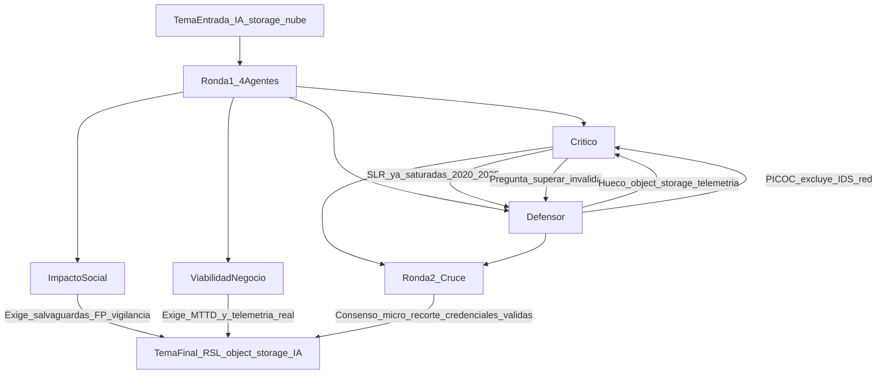

# Veredicto del panel — IA y detección de amenazas en almacenamiento en la nube

## BLOQUE_TEMA (entrada)
- Título: Aplicación de Inteligencia Artificial para la detección de accesos anómalos y amenazas de seguridad en servicios de almacenamiento en la nube.
- Problemática (pregunta, refinada según estándar RSL): ¿De qué manera las técnicas y modelos de inteligencia artificial pueden superar las limitaciones de los métodos convencionales para detectar a tiempo accesos anómalos y amenazas emergentes en servicios de almacenamiento en la nube, cuando el volumen de telemetría, la variabilidad del comportamiento legítimo y el uso de credenciales auténticas por atacantes dificultan la detección?
- Objeto de estudio (entrada): Las técnicas y modelos de inteligencia artificial utilizados para detectar accesos anómalos y amenazas de seguridad en servicios de almacenamiento en la nube, considerando efectividad, precisión y capacidad de detección.
- Tópicos (3) tentativos: detección de anomalías · seguridad en la nube · aprendizaje automático / amenazas
- Carrera/contexto: Ingeniería de Software
- Notas: El panel reformuló la pregunta (síntesis comparativa, no promesa de «superación» global) y acotó población a object storage y telemetría del plano de datos.

## Veredicto global
**GO_con_cambios**  
Riesgo de rechazo (Scopus/revisor externo): **medio** (alto si se mantiene el planteamiento genérico «IA + cloud security»; medio tras el recorte PICOC acordado)

## Diagrama del debate

## Fuentes consultadas (panel)
- Hagemann & Katsarou (2020), revisión sistemática anomalías en nube — ACM AICCC: https://dl.acm.org/doi/10.1145/3442536.3442550
- Nassif et al. / SLR ML en seguridad cloud — IEEE Access (repositorio ADU): https://repository.adu.ac.ae/items/64ab6c28-f0b9-4ce1-9524-e6ae14c98a86
- Bibliometría ML/DL + cloud security — *Artificial Intelligence Review* (2024): https://link.springer.com/article/10.1007/s10462-024-10776-5
- SLR IDPS en cloud (2025) — *Discover Computing*: https://link.springer.com/article/10.1007/s10791-025-09641-y
- Revisión seguridad almacenamiento cloud 2020–2024 — IIETA IJSSE: https://iieta.org/journals/ijsse/paper/10.18280/ijsse.150403
- Omogbehin et al., ML y seguridad de datos en nube — IJ-AI: https://ijai.iaescore.com/index.php/IJAI/article/view/27029/14914
- AWS GuardDuty S3 Protection (telemetría data events): https://docs.aws.amazon.com/guardduty/latest/ug/s3-protection.html
- Mandiant / UNC5537 (credenciales válidas, Snowflake): https://cloud.google.com/blog/topics/threat-intelligence/unc5537-snowflake-data-theft-extortion
- IBM Cost of a Data Breach 2024: https://www.ibm.com/think/insights/whats-new-2024-cost-of-a-data-breach-report
- UNESCO Recomendación ética IA; OCDE Principios IA (2024)
- CSA — ruido de alertas e IA en SOC (2026): https://labs.cloudsecurityalliance.org/wp-content/uploads/2026/09/CSA_research_note_ai_soc_alert_noise_20260914-csa-styled.pdf
- CLUE-LDS (dataset UEBA storage): https://zenodo.org/records/7119953

## Ataques del crítico
- El corredor «ML/DL + cloud security + anomaly detection» ya tiene SLR, bibliometrías y mapeos 2020–2025; una RSL genérica sin contribución explícita arriesga rechazo por originalidad insuficiente.
- La pregunta con verbo «superar» implica superioridad causal que la literatura heterogénea no permite demostrar en síntesis sistemática.
- Los tópicos tentativos (UEBA, cloud security amplio) arrastran SIEM/vendor y IDS de red; el ancla académica a *storage* es estrecha (p. ej. CLUE-LDS, papers CloudTrail/GNN).
- «Ingeniería de Software» no se sostiene si el informe queda en ciberoperaciones abstractas sin artefactos, telemetría y trade-offs de despliegue.
- Métricas solo accuracy/F1 en KDD/CICIDS sin plano de almacenamiento no responden la problemática de credenciales auténticas y volumen de logs de objetos.
- Documentación y blogs de hyperscalers no son estudios primarios revisables.
### Fuentes del crítico
- ACM 2020; Springer AIR 2024; Discover Computing 2025; IIETA IJSSE; arXiv CloudTrail/GNN (2606.28923); Zenodo CLUE-LDS.

## Defensa
- La problemática es operativa y documentada: data events de alto volumen, variabilidad legítima y abuso con identidad válida (GuardDuty, incidentes Snowflake/UNC5537).
- Las revisiones existentes son más amplias (toda la nube, seis familias de controles en storage) o no comparan finamente IA frente a baselines en la misma telemetría de object storage.
- Hueco defendible: síntesis de primarios cuyo artefacto evaluado sea detección en servicios de almacenamiento (APIs de objetos, audit logs, UEBA sobre GetObject/PutObject, etc.) con outcomes de precisión, recall, latencia y detección oportuna.
- El sesgo de datasets sintéticos puede convertirse en hallazgo metodológico de la RSL, no ocultarse.
- Alineación SE: pipelines de observabilidad, integración SIEM, coste de ingestión y requisitos no funcionales del componente de detección.
### Fuentes del defensor
- IIETA storage SR; Omogbehin IJ-AI; Springer bibliometría 2024; AWS GuardDuty; Facade (arXiv 2412.06700); RoleSentry (PMLR); EPJ Plus CloudSecureAI.

## Impacto social
- Beneficiarios: personas y PYMEs cuyos datos residen en nube; equipos sin SOC pleno; sector público con expedientes digitalizados.
- Valor público: ODS 9 (infraestructura digital), ODS 16 (confianza e integridad de información); riesgo real tras filtraciones masivas (Snowflake 2024).
- La RSL solo aporta socialmente si distingue laboratorio vs producción y declara salvaguardas (supervisión humana, límites de logs, falsos positivos, no medicalizar/vigilar más allá de seguridad).
- Brecha LATAM: requisitos de GPU, talento y telemetría pueden dejar fuera a organizaciones pequeñas si no se explicita transferencia.
### Fuentes
- Ars Technica Snowflake 2024; Mandiant UNC5537; CEPAL digital/PYME; Carta Derechos Digitales (ciberseguridad); UNESCO/OCDE ética IA; informe LATAM CISO (BID); CSA alert noise.

## Viabilidad empresarial
- Demanda **alta**: DSPM/CASB en crecimiento, controles nativos (GuardDuty, Defender for Storage), NIS2 y presión por MTTD.
- Salida útil: marco de evaluación IA vs reglas/controles nativos con métricas operativas (FP, MTTD, coste de ingestión), no catálogo de algoritmos.
- Exigencia: objeto = almacenamiento en nube en sentido estricto; comparación bajo las tres fricciones del enunciado (volumen, variabilidad, credenciales robadas).
### Fuentes
- IBM Cost of a Data Breach 2024; EUR-Lex NIS2 / reglamento 2024/2690; Emergen Research cloud data security; Frost DSPM; AWS/Microsoft documentación de detección en storage.

## Debate entre agentes
### Choques principales
- **Crítico vs Defensor:** saturación de revisiones vs hueco micro-recortado (object storage + telemetría de acceso a objetos + escenario credencial válida). Resolución: **GO solo con PICOC estricto** y pregunta reformulada; de lo contrario el crítico mantiene riesgo alto.
- **Impacto vs Negocio:** el negocio empuja métricas SOC y cumplimiento; impacto exige no sacrificar derechos por caja negra ni fatiga de alertas. Resolución: la RSL debe incluir dimensión operativa **y** salvaguardas éticas en la discusión, no solo F1.

### Preguntas cruzadas
1. El crítico pregunta al defensor: ¿qué pregunta única no responden Discover Computing (2025) e IIETA storage sobre IA + anomalías + storage?
   - **Respuesta / resolución:** síntesis de primarios que evalúen **solo** telemetría del plano de datos de object storage y abuso con identidad válida, clasificando validez de evaluación (datasets reales vs sintéticos) y comparación explícita con baselines convencionales en el mismo escenario.
2. El defensor reta al crítico: ¿object storage solo o también file/SaaS?
   - **Respuesta / resolución:** consenso del panel en **object storage gestionado** (S3, Blob, GCS) con logs de acceso a objetos; SaaS/file queda fuera salvo evidencia peer-reviewed homogénea en cribado 2.
3. Impacto social exige: criterios de inclusión que exijan discusión de falsos positivos o escenarios realistas (MFA ausente, telemetría incompleta); excluir papers que solo optimicen F1 sin costo operativo.
4. Viabilidad empresarial exige: métricas MTTD/FP y comparabilidad; exclusiones obligatorias de IDS de red sin capa storage identificable.

### Recomendaciones cruzadas
- El crítico obliga a: declarar contribución frente a ACM 2020, Nassif/IEEE Access, Springer 2024, IIETA storage, Discover Computing 2025; excluir vendor docs como primarios.
- El defensor propone conservar: triada volumen + variabilidad + credenciales válidas como núcleo de la problemática.
- Impacto social impone salvaguarda: subsección de detección responsable (supervisión humana, finalidad de logs, equidad regional).
- Negocio impone salida accionable: checklist de telemetría mínima y tabla de trade-offs precisión/latencia/coste.

## 5 mejoras mínimas antes de presentar
1. Sustituir «superar» en la pregunta de investigación por síntesis comparativa bajo telemetría y amenaza equivalentes (PICOC).
2. Fijar población: servicios de **object storage** en la nube; exclusión explícita de IDS de red/KDD sin eventos de almacenamiento.
3. Redactar en una frase la **contribución** diferenciada frente a las cinco revisiones citadas en el debate.
4. Ampliar outcomes más allá de precisión: latencia, tasa de falsos positivos, tiempo hasta detección, coste de ingestión.
5. Anclar Ingeniería de Software en artefactos evaluados (pipelines, APIs, integración SOC), no solo en taxonomía de algoritmos.

## Tema final propuesto

### Título final
Inteligencia artificial para la detección de accesos anómalos y amenazas de seguridad en servicios de almacenamiento en la nube (*object storage*): revisión sistemática de técnicas, modelos y evidencia de evaluación

### Problemática final
¿Qué técnicas y modelos de inteligencia artificial se han evaluado para detectar accesos anómalos y amenazas de seguridad en servicios de almacenamiento en la nube basados en *object storage*, en escenarios de alto volumen de telemetría del plano de datos, comportamiento legítimo variable y abuso con credenciales válidas, y qué evidencia existe sobre su efectividad, precisión y capacidad de detección en comparación con métodos convencionales (reglas, firmas, umbrales estáticos) en condiciones de evaluación comparables?

### Objeto de estudio / objetivo final
Realizar una revisión sistemática de la literatura que identifique y sintetice estudios primarios que propongan o evalúen técnicas y modelos de inteligencia artificial (aprendizaje automático, aprendizaje profundo, detección de anomalías y analítica conductual aplicada a logs de acceso a objetos) para la detección de accesos anómalos y amenazas en servicios de almacenamiento en la nube, analizando métricas de desempeño, validez de los escenarios de evaluación y requisitos de despliegue desde la perspectiva de la ingeniería de software.

### Tópicos (3) finales
1. Detección de anomalías en accesos y operaciones sobre datos almacenados en la nube — **IEEE: Anomaly detection (p.24)**
2. Seguridad de servicios de computación en la nube en el plano de almacenamiento — **IEEE: Cloud computing security (p.82)**
3. Protección de datos y amenazas a la confidencialidad e integridad en almacenamiento externalizado — **IEEE: Data security (p.123)**; complemento metodológico: **IEEE: Machine learning (p.294)** para el eje «técnicas y modelos de IA» en `rsl-picoc`

### Por qué se eligió este recorte
Concentra el tema donde la problemática del usuario es más defendible (credenciales válidas, logs masivos de objetos) y reduce solapamiento con revisiones ya publicadas sobre «cloud security + ML» en general. Permite a Ingeniería de Software enmarcar el objeto en telemetría, pipelines y trade-offs de despliegue, y da respuesta al crítico sobre originalidad mediante población y criterios de evaluación explícitos.

### Aporte científico defendible (una frase)
Mapa reproducible de técnicas y modelos de IA evaluados específicamente sobre telemetría de *object storage*, con síntesis de métricas y de la validez externa de los escenarios (incluido el abuso con credenciales válidas) frente a baselines convencionales.

### Alcance y exclusiones
- **Incluye:** estudios peer-reviewed que evalúen detección de accesos anómalos o amenazas en S3/Azure Blob/GCS o equivalentes; logs de data events, audit de buckets, datasets tipo Amazon Access/CLUE-LDS; comparación con métodos no basados en aprendizaje cuando exista.
- **Excluye:** IDS de red o endpoint sin capa de almacenamiento identificable; papers centrados solo en cifrado en reposo o DLP sin detección conductual; documentación comercial y blogs de proveedores como estudios primarios; optimización de F1 en benchmarks de red sin relación con almacenamiento en nube.

### Riesgos residuales y cómo mitigarlos
- **Pocos primarios tras cribado:** reportar el hallazgo como vacío de evidencia en el subdominio y ampliar solo con justificación protocolizada (no ad hoc).
- **Métricas incomparables:** usar síntesis narrativa por familias de técnica y tabla de limitaciones metodológicas.
- **Perfil SE cuestionado:** vincular cada estudio incluido a artefacto software (pipeline, servicio, integración API/SIEM).
- **Riesgo ético (falsos positivos/vigilancia):** discutir en marco UNESCO/OCDE y CSA sobre ruido de alertas.

### Criterios de éxito ante un revisor Scopus
- Pregunta PICOC/PICOCT explícita, distinta de SLR 2020–2025 ya citadas.
- Protocolo PRISMA 2020 con criterios de inclusión que reflejen object storage y credenciales válidas.
- Discusión que no prometa superioridad global de la IA sino condiciones bajo las cuales aporta detección oportuna.
- Tabla de evidencia por proximidad al dominio (telemetría real vs sintética).
- Contribución clara para equipos de ingeniería cloud (telemetría mínima, métricas operativas).

### Listo para siguiente skill
`rsl-make-report` sobre `docs/ia-deteccion-amenazas-almacenamiento-nube/`
