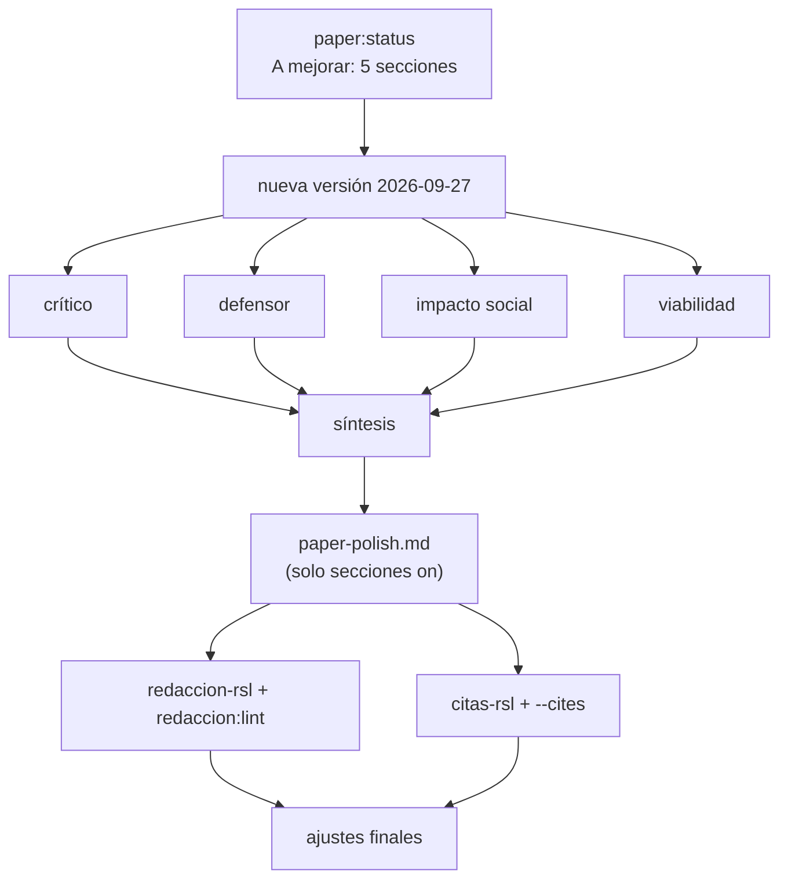

---

## Corrida 2026-09-27 — observaciones del docente

Secciones: contexto, problema, justificacion, objetivo-rsl, organizacion en `on` (mejorar); encabezado `frozen` (copiado tal cual).
Motivo: revisión del docente (mantener la estructura; más naturalidad; sin jerga de nota de trabajo; menos densidad; definir DoD, CI, GenAI y COGA al inicio; coherencia citas ↔ referencias).

### Turnos

**Crítico.** Vacío sobre-reclamado frente a Paiva et al. (2021), que ya ordena por fase la accesibilidad en Ingeniería de Software: nombrarlo en el vacío. Xu et al. es diseño de interacción, no clínico. La tendencia atribuida a Aljedaani y Mollik no está en la fuente; la regulación citada sin referencia. Objetivo sin objetivos específicos por RQ (la T desaparecía). Anexo anunciaba un piloto inexistente.

**Defensor.** Conservar el vacío, las cifras de las revisiones previas, las tres tensiones y los tres niveles de transferencia (automático, experto, usuarios). Definir la taxonomía una vez en palabras y llamarla después «la taxonomía». Recuperar Xu y Paiva en el Contexto.

**Impacto social.** «Usuarios COGA» es un error: COGA es un grupo de trabajo del W3C. Normas y ODS sin siglas crípticas; la meta 4.a (instalaciones físicas) encaja mal. Restaurar la salvaguarda ética comprimida.

**Viabilidad.** Explicar la integración continua y la *Definition of Done* para lectores que no vienen de DevOps; expresar los tres niveles con un ejemplo; plan B como mapa de vacíos.

### Síntesis aplicada

1. Siglas del núcleo definidas en el Contexto (WCAG, W3C, COGA, IA, GenAI, V&V, CI); DoD sin sigla (se usa una vez); TEA, TDAH, ODS, EAA y PCM escritos completos o retirados.
2. Taxonomía definida una vez en palabras; sin ×, «GenAI+web», «WCAG-dura», «celda aguda», «remake» ni «gate».
3. Paiva en el vacío; Xu reetiquetado; afirmación de Aljedaani ajustada a la fuente.
4. Pregunta alineada con la pregunta general de picoc (incluye diseño y personalización); seis objetivos específicos, uno por RQ.
5. Justificación: Ley 29973 con referencia; ODS 10.2 y 4.5; tres niveles con ejemplo; «no pretende certificar el cumplimiento normativo».
6. Organización: PRISMA 2020 citado; sin piloto; comparación con revisiones previas en anexo.

### Redacción — pass

`redaccion:lint`: PASS, 0 FAIL; sin avisos en las secciones pulidas (los avisos restantes están en el encabezado frozen).

| # | Ajuste de redaccion-rsl aplicado |
|---|----------------------------------|
| 1 | «dichas barreras» sin referente → «las barreras de comprensión, memoria y carga cognitiva»; definición de neurodivergencia partida |
| 2 | «Ese recorte exige situar lo ya sintetizado» → «Este alcance obliga a revisar primero lo que ya han sintetizado las revisiones previas» |
| 3 | 4 siglas en un párrafo → se quita GenAI donde bastaba «modelos de lenguaje» |
| 4 | «Por eso» sin vínculo → condición explícita sobre controles limitados a WCAG |
| 5 | «carecen de evidencia frente al sesgo» → «dado el predominio de los estudios centrados en la discapacidad sensorial» |
| 6 | El vacío dice qué es («falta una síntesis que los integre»), no solo qué no es |
| 7 | Metadiscurso «se eligió un tema» → «esta revisión articula tres elementos» |
| 8 | «automatizarse en la CI» → «verificarse automáticamente en la CI» |

Pendiente fuera de alcance (encabezado frozen): título de 28 palabras con subtítulo en cascada (R6) y notación de trabajo en Tema/Problemática/Objetivo (×, «GenAI+web», «WCAG-duro», V&V/SE/LLM sin definir). Recomendación: pasar `encabezado` a `on`.

### Citas — pass (tras correcciones)

`--cites`: PASS · 9 referencias.

| # | Hallazgo de citas-rsl | Acción |
|---|-----------------------|--------|
| 1 | Aljedaani y Mollik analizan 33 estudios primarios (el resumen dice 38) | Corregido a 33 en el paper |
| 2 | Xu et al.: volumen 21(4) impreso el 19-05-2026 | Año 2026 en texto y referencia |
| 3 | La fuente habla de definir, detectar y evaluar, no de corregir | Frase ajustada |
| 4 | Autismo y trastornos neurológicos son categorías distintas en Chemnad y Othman | Redacción ajustada |
| 5 | Nuevas: Page et al. (2021), Congreso de la República del Perú (2012), W3C (2021) | Verificadas (Crossref, PubMed, W3C) |
