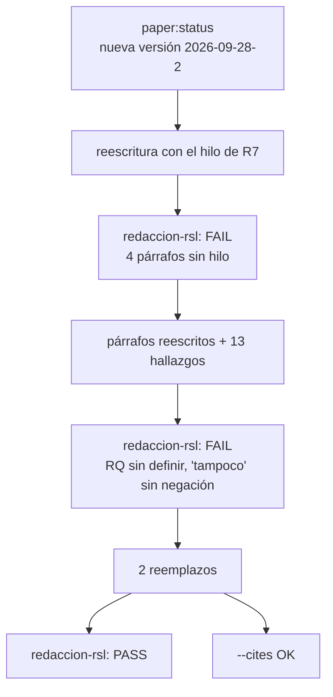

---

## Corrida 2026-09-28-2 — hilo y cohesión de la Metodología

Secciones en `on` (mejorar): objetivo-rsl, marco-pico, palabras-clave, ecuacion-busqueda, criterios-seleccion y seleccion-prisma, más el párrafo de apertura de II. Resto `frozen`, copiado tal cual. Versión anterior para comparar: `paper/2026-09-28/`.
Motivo: revisión del usuario. En la justificación de PICOC, cada oración definía algo distinto sin conexión, y el apartado PRISMA abría con la herramienta en lugar de guiar al lector. Se agregó la regla R7 (coherencia y progresión) al playbook de redacción, y `redaccion-rsl` pasó a revisar el hilo párrafo por párrafo (tabla Hilo).

### Hilo resultante

| Párrafo | Intención | Enlace con el anterior |
|---|---|---|
| Objetivo §1 | Objetivo general y su desglose en cinco RQ | Retoma la pregunta de El problema |
| Objetivo §2 | Salvaguardas éticas comprobables en selección y extracción | «Cumplir estos objetivos exige…» |
| Apertura de II | Por qué hace falta un protocolo previo (reproducibilidad) y el recorrido del capítulo | «Los objetivos anteriores incluyen señalar…» |
| A §1 | Por qué PICOC: la pregunta necesita comparación y contexto, que el marco clínico no tiene | «La primera decisión parte de la forma de la pregunta» |
| A §2 | Dos decisiones de alcance: la ventana como criterio y la población amplia | «Concretar sus componentes exigió, además…» |
| A §3 | Del marco a la pregunta general y a las RQ | «Con esas decisiones…» |
| B | Traducir los componentes a vocabulario controlado y libre | «Una vez fijados los componentes…» |
| C §1 | Estructura de la ecuación y su efecto en el bloque de comparación | «Con esas palabras clave…» |
| C §2 | Qué filtrado se deja para después: campos y filtros | «Exigir los cinco bloques a la vez ya restringe…» |
| D | Por qué los criterios se fijan antes y qué delimitan | «Los registros recuperados todavía mezclan…» |
| E | Por qué documentar la selección con PRISMA 2020 | «Aplicar esos criterios…» |

### Decisiones para el usuario (no aplicadas)

| Tema | Propuesta | Dónde se decide |
|---|---|---|
| Elección de las bases | Justificar por qué Scopus y Web of Science, con una fuente | Usuario (no hay fuente documentada) |
| Título (R6) | Unas 28 palabras con subtítulo en cascada; propuesta: *Inteligencia artificial en el ciclo de vida del software para la accesibilidad cognitiva: una revisión sistemática*, alineando la ficha | Descongelar el encabezado |
| Pendientes de la corrida anterior | CI1, etapa 3 de PRISMA, alcance de la población, `ALL=` o `TS=` | Ver `paper/2026-09-28/paper-debate.md` |

### Redacción y citas

| Control | Resultado |
|---|---|
| `redaccion-rsl` | PASS en la tercera pasada; los 11 párrafos trabajados OK en la tabla Hilo |
| `redaccion:lint` | 0 FAIL. Avisos solo en el encabezado congelado y en la pregunta literal. 16 marcadores del usuario |
| `paper:status --cites` | OK, 10 referencias |
