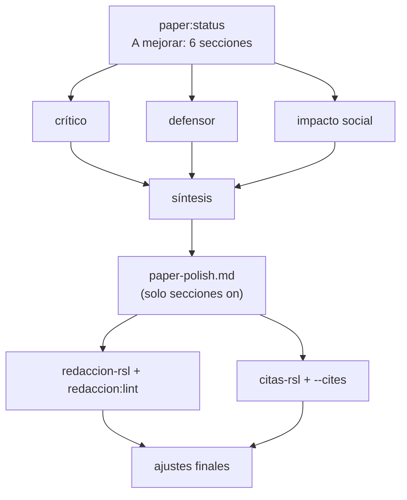

---

## Corrida 2026-09-28 — Metodología y objetivos

Secciones en `on` (mejorar): objetivo-rsl, marco-pico, palabras-clave, ecuacion-busqueda, criterios-seleccion y seleccion-prisma. Encabezado, contexto, problema, justificación y organización quedaron `frozen` y se copiaron tal cual; calidad está `off` hasta que exista la selección PRISMA.
Marco: PICOC, según `picoc/2026-09-28-4-PICOC/picoc.md`. Fuentes metodológicas del catálogo compartido: Kitchenham y Charters (2007) y Page et al. (2021).

### Turnos

**Crítico.** PICOC se atribuía a Kitchenham y Charters, que lo toman de Petticrew y Roberts. La cita sobre no restringir la población se refiere a poblaciones de Ingeniería de Software, no a perfiles de usuarios. El bloque de comparación de la ecuación no recupera el contraste por sí solo, porque `accessibility` lo satisface cualquier estudio de accesibilidad. Faltaba justificar que Web of Science se busque en todos los campos y Scopus en título, resumen y palabras clave. PRISMA es una guía de reporte, no el método de selección. Las etapas PRISMA no mostraban cuándo se aplican el tipo de documento y el idioma, y a texto completo se excluye por no cumplir criterios de inclusión, no solo por los de exclusión. El objetivo general no recogía la identificación de combinaciones sin evidencia.

**Defensor.** Se sostienen PICOC sin componente temporal, la población amplia, la ventana como criterio de inclusión, las dos bases y los cinco objetivos, uno por RQ. Faltaba la razón para no usar T: el marco original no la tiene y la fecha es una decisión de búsqueda y selección. El término general `accessibility` es un acierto (evita exigir una discapacidad sensorial) y había que decirlo. La justificación de CI1 por la adopción masiva de la GenAI en 2023 es débil para un corte en 2020.

**Impacto social.** La participación de personas con discapacidad debe codificarse por niveles. Las salvaguardas eran declaraciones: hay que atarlas al método (CE4 y campos de extracción). «No sustituye la evidencia clínica» volvía a medicalizar. Faltaba registrar la inferencia de la condición y el consentimiento, y el país del estudio para el sesgo geográfico. El alcance «usuarios» deja fuera a desarrolladores neurodivergentes.

### Síntesis aplicada

1. PICOC atribuido a Petticrew y Roberts a través de Kitchenham y Charters (2007, p. 11); la población amplia, presentada como analogía, con la estratificación en la extracción de la RQ1.
2. Razón explícita para no usar un componente temporal; la ventana de 2020 a 2026 queda como criterio de inclusión.
3. Ecuación: el bloque de comparación ancla la recuperación en la accesibilidad y el contraste de la RQ3 se resuelve en la extracción; la búsqueda en todos los campos de Web of Science se justifica por exhaustividad; la fecha se aplica después de la búsqueda y el tipo de documento y el idioma durante el cribado.
4. PRISMA 2020 presentado como guía de reporte; sin afirmar que el diagrama demuestra vacíos; la etapa de texto completo excluye por criterios de inclusión o exclusión.
5. Objetivo general con la identificación de combinaciones sin evidencia; la clasificación entre integración continua, juicio experto y pruebas con usuarios atada al objetivo 4; participación por niveles en el objetivo 1.
6. Salvaguardas verificables: CE4, campos de extracción (déficit o diferencia, inferencia de la condición, consentimiento, país) y rótulos diagnósticos solo como términos de búsqueda.
7. Redacción: RQ, SE, HCI, AT, TEA y TDAH definidos antes de la pregunta literal y de los criterios; integración continua escrita completa para no confundirla con los códigos CI1 a CI6; oraciones largas divididas.

### Decisiones para el usuario (no aplicadas)

| Tema | Propuesta | Dónde se decide |
|---|---|---|
| Justificación de CI1 | Presentar 2020 como línea base de tres años antes de la GenAI, o dar fuente a «adopción masiva (2023)» | rsl-picoc (criterios) |
| Etapa 3 de PRISMA | Ampliarla a «eliminados antes del cribado por fecha, tipo de documento o idioma»; hoy solo fecha, según lo pedido | Usuario |
| Alcance de la población | Solo usuarios finales, o incluir desarrolladores y evaluadores neurodivergentes | rsl-picoc |
| Campo de Web of Science | `ALL=` frente a `TS=` (tema), más usual y equivalente a Scopus | rsl-picoc (queries) |

### Redacción y citas

| Control | Resultado |
|---|---|
| `redaccion:lint` | 0 FAIL. Avisos solo en el encabezado congelado y en la pregunta general, que va literal del protocolo. 16 marcadores del usuario pendientes (`X`, `[[ AGREGAR DIAGRAMA ]]`) |
| `paper:status --cites` | OK, 10 referencias |
| `citas-rsl` | PASS (Kitchenham y Charters, p. 11 impresa = PDF p. 19; Page et al., p. 1 impresa = PDF p. 2) |
