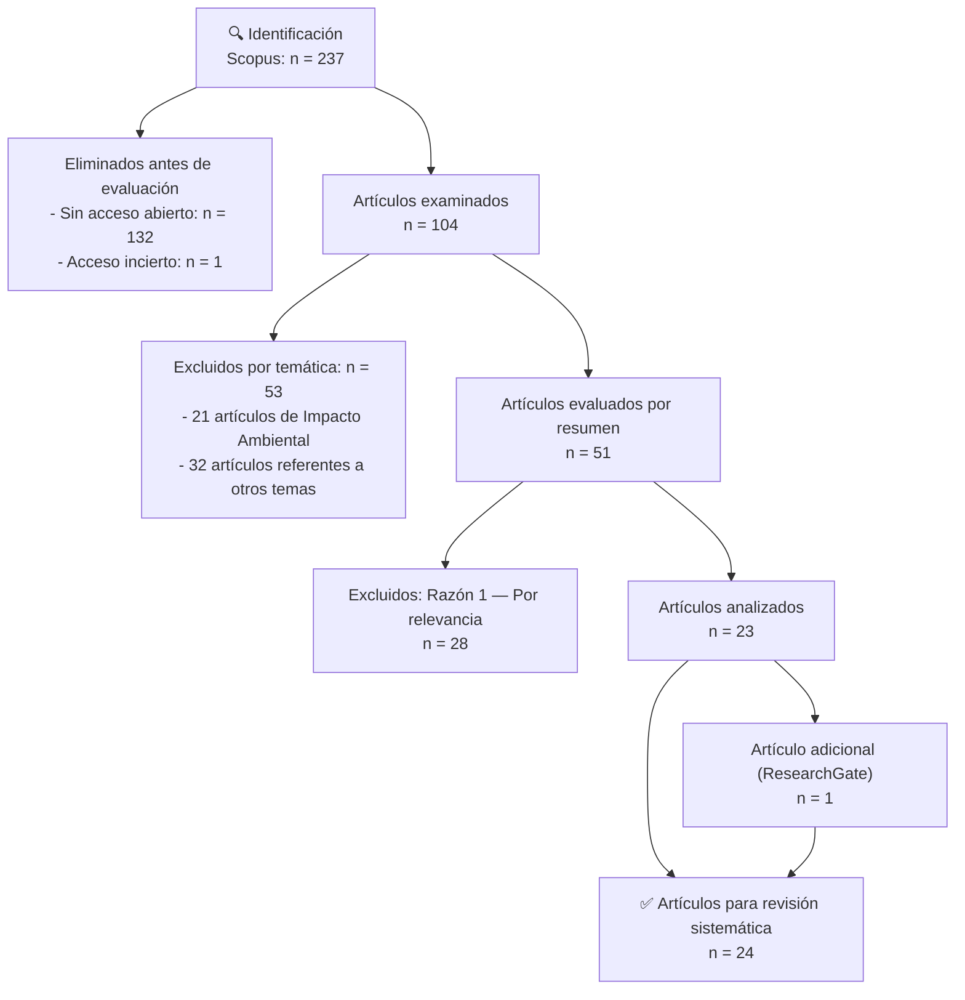
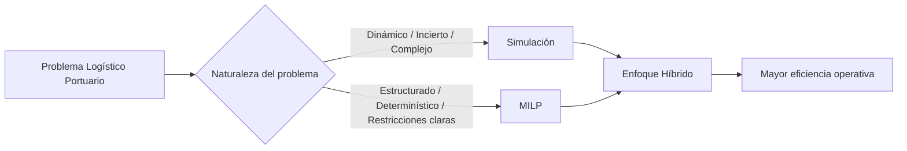

# Systematic Literature Review on the Operational Efficiency of Logistic in Port Management: Analysis of Simulation and Linear Programming Methodologies

**Revisión Sistemática de la Literatura (RSL) sobre la eficiencia operativa de la Logística en la Gestión Portuaria: análisis de las metodologías de Simulación y Programación Lineal**

---

**Autores:**
Gomez Cancino, Nallely Milagros¹; Tanga Huaman, Emely Susan Milagros²; Segura Peña, Lidia Victoria³; Torres Mayanga, Paulo Cesar⁴

¹⁻⁴ Universidad Tecnológica del Perú, Perú
`U20307454@utp.edu.pe` | `U20207470@utp.edu.pe` | `C19365@utp.edu.pe` | `C22786@utp.edu.pe`

**Publicado en:** 23rd LACCEI International Multi-Conference for Engineering, Education, and Technology — "Engineering, Artificial Intelligence, and Sustainable Technologies in service of society". Hybrid Event, Mexico City, July 16–18, 2025.

**ISBN:** 978-628-96613-1-6 | **ISSN:** 2414-6390
**DOI:** https://dx.doi.org/10.18687/LACCEI2025.1.1.2216

---

## Abstract

Efficient port management is important for maritime trade. In the optimization of logistic processes, this study examines the use of methodologies such as **Simulation** and **Mixed Integer Linear Programming (MILP)**. It is highlighted that these methodologies are effective in identifying and correcting inefficiencies, which contributes to cost reduction. In addition, the importance of optimizing resources is analyzed, as this maximizes productivity. This systematic review suggests that an integrated approach that combines both Simulation and MILP methodologies would facilitate adaptability to changing market demands. Finally, it is essential to continue exploring new technologies and analyzing data for better results and operational efficiency.

**Keywords:** operational efficiency, logistics, methodologies, optimization, port management.

---

## Resumen

La gestión portuaria eficiente es importante para el comercio marítimo. En la optimización de procesos logísticos, este estudio examina el uso de metodologías como la **Simulación** y la **Programación lineal de enteros mixtos (MILP)**. Se destaca que estas metodologías son efectivas para identificar y corregir ineficiencias, lo que contribuye a la reducción de costos. Además, se analiza la importancia de optimizar los recursos, ya que esto maximiza la productividad. Esta revisión sistemática sugiere que un enfoque integral que combine tanto la metodología de Simulación como la MILP facilitaría la adaptabilidad de las cambiantes demandas del mercado. Por último, es fundamental seguir explorando nuevas tecnologías y analizar datos para obtener mejores resultados y eficiencia operativa.

**Palabras clave:** eficiencia operativa, logística, metodologías, optimización, gestión portuaria.

---

## I. Introducción

En los últimos años, la industria portuaria ha experimentado cambios significativos debido a factores como las tensiones geopolíticas, las variaciones en las políticas comerciales globales y la creciente demanda de eficiencia en la cadena de suministro. Estos desafíos han afectado de manera crítica la operación de los puertos, generando problemas como el aumento en el tiempo de almacenamiento de contenedores, retrasos en el tránsito marítimo y mayores costos de combustibles debido a la necesidad de acelerar la navegación [1][2][3]. Como consecuencia, la eficiencia operativa de los puertos se ha visto comprometida, afectando no solo la rentabilidad de las operaciones, sino también la competitividad de las terminales en el comercio internacional.

Entre las principales deficiencias logísticas identificadas se encuentran la gestión inadecuada del almacenamiento, los problemas de tráfico marítimo, la deficiente planificación de rutas de acceso y la congestión en la asignación de muelles [4][5]. Estos factores impactan directamente en los costos operativos y en los niveles de servicio ofrecidos, subrayando la necesidad de optimizar los procesos logísticos dentro de la gestión portuaria. En este contexto, el enrutamiento eficiente de buques, la reducción de tiempo de carga y descarga, y la asignación óptima de recursos como grúas y vehículos internos son elementos críticos para lograr una operación más eficiente [6], [7].

La optimización de la logística portuaria se ha abordado mediante el uso de diversas metodologías, destacándose especialmente la **Simulación** y la **Programación Lineal de Enteros Mixtos (MILP)**. Estas técnicas permiten analizar escenarios operativos, prever cuellos de botella y mejorar la toma de decisiones estratégicas. La simulación ofrece una representación dinámica y flexible de los procesos portuarios, siendo ideal para gestionar situaciones complejas y de alta incertidumbre. Por otro lado, la MILP proporciona soluciones óptimas en problemas estructurados con restricciones claramente definidas, como la programación de atraques y la asignación de recursos críticos [5], [7].

La importancia de optimizar la eficiencia operativa en los puertos va más allá de la simple reducción de costos. Una gestión logística eficiente permite disminuir el tiempo de permanencia de buques, aumentar la rotación de contenedores, mejorar el aprovechamiento de la infraestructura existente y ofrecer servicios más competitivos. Estos factores son esenciales para fortalecer la posición estratégica de los puertos en el mercado global.

Además, las tendencias actuales en la logística portuaria apuntan a la integración de tecnologías emergentes como la inteligencia artificial (IA), machine learning y el análisis avanzado de datos. La combinación de técnicas de optimización tradicionales como la MILP con algoritmos inteligentes permite el desarrollo de puertos inteligentes, capaces de adaptarse de manera autónoma a cambios en la demanda y condiciones operativas [8], [9]. Esta sinergia tecnológica no solo mejora la eficiencia, sino que también abre nuevas oportunidades para la automatización, sostenibilidad y la resiliencia de las operaciones portuarias.

En este contexto, el presente estudio tiene como finalidad realizar una Revisión Sistemática de la Literatura (RSL) sobre el uso de metodologías de simulación y programación en la optimización de la eficiencia operativa en la gestión portuaria. Se busca identificar los principales desafíos logísticos, analizar la efectividad de las metodologías aplicadas en función de la complejidad de los problemas, y explorar cómo la incorporación de tecnologías emergentes como la inteligencia artificial y el aprendizaje automático puede fortalecer la competitividad de los puertos frente a un mercado en constante cambio.

El documento se organiza de la siguiente manera:
- **Sección 2:** Metodología empleada — estrategia de búsqueda y criterios de selección.
- **Sección 3:** Resultados — análisis de datos relevantes y respuesta a las preguntas de investigación.
- **Sección 4:** Discusión — hallazgos en función de la naturaleza de los problemas logísticos y la eficacia de las metodologías.
- **Sección 5:** Conclusiones y recomendaciones.

---

## II. Metodología

Para garantizar la rigurosidad y la relevancia de esta revisión sistemática, se aplicó el **modelo PICOC** para la formulación de las preguntas de investigación y la estrategia de búsqueda de literatura. Asimismo, se utilizó el **diagrama de flujo PRISMA** para organizar el proceso de selección de estudios [10].

### Modelo PICOC

Se empleó el modelo PICOC para definir con precisión los elementos de interés: Población, Intervención, Comparación, Resultados y Contexto.

**Tabla I — Metodología PICOC**

| P | I | C | O | C |
|---|---|---|---|---|
| Eficiencia operativa en el área logística | La implementación de metodologías de optimización | Metodologías de optimización más utilizadas para la eficiencia operativa | Resultados de eficiencia operativa de las metodologías más utilizadas | Gestión portuaria |

### A. Pregunta PICO y sus componentes

**Pregunta principal de investigación:**

> ¿Qué metodologías de optimización se utilizan para determinar los resultados de eficiencia operativa en el área logística de la gestión portuaria?

**Tabla II — Preguntas PICO**

| Componente | Código | Pregunta |
|---|---|---|
| P | RQ1 | ¿Cómo se ha definido la eficiencia operativa en el área logística? |
| I | RQ2 | ¿Qué modelos o enfoques de las metodologías de optimización se han desarrollado en la logística portuaria? |
| C | RQ3 | ¿Cómo se comparan las metodologías de optimización en términos de eficacia y naturaleza del problema? |
| O | RQ4 | ¿Cómo se refleja la eficiencia operativa al aplicar las metodologías de optimización? |

### B. Palabras clave pertinentes

**Tabla III — Palabras clave para la revisión sistemática**

| Componente | Palabras clave (ES) | Keywords (EN) |
|---|---|---|
| P | Área logística | Logistics Area, Logistic Department |
| I | Metodología de optimización | Optimization Methodology, Optimization Methodologies, Optimal Methodologies |
| C | Metodología | Methodology, methods |
| O | Eficiencia operativa | Operational efficiency, operative efficiency, operational effectiveness, operational performance |
| C | Gestión portuaria | Port Management, Harbor Operations, Port Administration |

### C. Ecuación de búsqueda

La estrategia de búsqueda combinó los términos mediante operadores booleanos `AND` y `OR`, aplicando filtros de pertinencia. Ecuación resultante:

```
( TITLE-ABS-KEY ( port AND management OR logistic AND optimization ) )
AND PUBYEAR > 2018 AND PUBYEAR < 2025
AND ( LIMIT-TO ( PUBSTAGE,"final" ) )
AND ( LIMIT-TO ( SUBJAREA,"ENGI" ) OR LIMIT-TO ( SUBJAREA,"MATH" )
   OR LIMIT-TO ( SUBJAREA,"BUSI" ) OR LIMIT-TO ( SUBJAREA,"COMP" ) )
AND ( LIMIT-TO ( DOCTYPE,"ar" ) )
AND ( LIMIT-TO ( LANGUAGE,"English" ) OR LIMIT-TO ( LANGUAGE,"Chinese" )
   OR LIMIT-TO ( LANGUAGE,"Spanish" ) )
AND ( LIMIT-TO ( EXACTKEYWORD,"Optimization" )
   OR LIMIT-TO ( EXACTKEYWORD,"Maritime Transportation" )
   OR LIMIT-TO ( EXACTKEYWORD,"Ships" )
   OR LIMIT-TO ( EXACTKEYWORD,"Port Operation" )
   OR LIMIT-TO ( EXACTKEYWORD,"Containers" )
   OR LIMIT-TO ( EXACTKEYWORD,"Port Terminals" )
   OR LIMIT-TO ( EXACTKEYWORD,"Shipping" )
   OR LIMIT-TO ( EXACTKEYWORD,"Algorithm" )
   OR LIMIT-TO ( EXACTKEYWORD,"Ports And Harbors" )
   OR LIMIT-TO ( EXACTKEYWORD,"Costs" )
   OR LIMIT-TO ( EXACTKEYWORD,"Simulation" )
   OR LIMIT-TO ( EXACTKEYWORD,"Efficiency" )
   OR LIMIT-TO ( EXACTKEYWORD,"Logistics" ) )
```

> La búsqueda se realizó el **3 de octubre de 2024** exclusivamente en la base de datos **Scopus**, recuperándose un total de **237 artículos iniciales**.

### D. Criterios de inclusión y exclusión

**Criterios de Inclusión:**
- **CI1:** Publicaciones entre 2019 y 2024
- **CI2:** Área temática de Ingeniería, Computación, Matemáticas, Negocios o Gestión
- **CI3:** Tipo de documento: artículos de investigación
- **CI4:** Fase de publicación finalizada
- **CI5:** Uso de palabras clave pertinentes
- **CI6:** Redacción en inglés, español o chino

**Criterios de Exclusión:**
- **CE1:** Artículos sin Identificador de Objeto Digital (DOI)
- **CE2:** Artículos sin acceso libre y gratuito
- **CE3:** Artículos no relacionados directamente con el área de logística portuaria

### E. Proceso de selección — Diagrama PRISMA



*Fig. 1 Diagrama del flujo PRISMA.*

---

## III. Resultados

Este estudio sistematizó los hallazgos de **24 artículos seleccionados** tras aplicar la metodología de búsqueda basada en PICOC y el flujo PRISMA.

### Distribución anual de publicaciones

La distribución anual de las publicaciones evidencia un creciente interés por el tema de optimización logística portuaria en los últimos años. El año **2023** concentra el mayor número de artículos revisados, mientras que en **2019** se identificó solo un estudio relacionado con la asignación de atraques [12].

```
Año de Publicación — Cantidad de artículos:

2019 ▓ (1)
2020 ▓▓▓▓ (4)
2021 ▓▓▓ (3)
2022 ▓▓▓ (3)
2023 ▓▓▓▓▓▓▓▓▓ (9)
2024 ▓▓▓▓ (4)
```

*Fig. 2 Cantidad de publicaciones por año.*

> El patrón indica que, si bien la temática está en una tendencia de expansión, existe una concentración de influencia en pocos estudios, lo que podría guiar futuras investigaciones hacia enfoques consolidados.

### Desafíos identificados en la logística portuaria

El desafío más reportado es la **gestión de almacenamiento**, derivada de problemas de capacidad y planificación. El tráfico marítimo y la asignación de muelles también emergen como factores críticos que afectan directamente los costos operativos y el tiempo de respuesta portuario.

**Tabla IV — Desafíos en la Logística Portuaria**

| Desafío | Artículos |
|---|---|
| Atraque de los buques (congestión) | [1], [21], [22] |
| Cambios en la red vial | [15] |
| Cargos de sobrestadías | [23] |
| Enrutamiento | [4], [24] |
| Falta de comunicación | [11], [19] |
| **Gestión del almacenamiento** | [2], [12], [13], [14], [15], [16], [17], [18] |
| Insuficiente capacidad de transporte | [25], [26], [27] |
| Manipulación de contenedores | [26] |
| Tardanza de carga y descarga | [13], [25] |
| Tiempo de permanencia de buques | [23], [28] |
| **Tráfico marítimo** | [3], [29], [19], [30], [1], [11] |
| Asignación de muelles | [21], [20], [2], [18] |

### A. Resultados de las preguntas PICO

#### RQ1 — Definición de eficiencia operativa en logística

La eficiencia operativa se define principalmente como la **reducción de costos logísticos**, **tiempos de operación** y **periodos de permanencia de los buques** [15], [16], [29]. Algunos autores incluyen también la **optimización del uso de equipamientos portuarios** como grúas de muelle y vehículos internos [16], [31].

Principales dimensiones identificadas (por frecuencia):
- **Optimizar uso de recursos** — 12 artículos
- **Reducir costos** — 8 artículos
- **Optimizar rutas** — 3 artículos
- **Reducir tiempos** — 3 artículos
- Otras (automatización, adaptarse a cambios, evitar sobrestadías, mayor eficiencia, minimizar retrasos, optimizar cadena, optimizar comunicación, optimizar flujos, optimizar operaciones, optimizar transporte, servicio de alta calidad) — 1 artículo cada una

*Fig. 5 — Definición de la eficiencia operativa en el área logística.*

#### RQ2 — Modelos y enfoques de metodologías de optimización

Posterior a la identificación de los desafíos, se analizó el tipo de metodologías de optimización empleadas. La **simulación** es la técnica más frecuentemente utilizada, seguida de la **MILP**.

**Metodologías identificadas (de mayor a menor uso):**

```
Simulación                    ████████████████ (mayor uso)
Programación Matemática       ████████
Programación de Enteros       ██████
Modelo Matemático             ████
ILP                           ███
MILP                          ██████████
HLP                           ████
ISL                           ███
Algoritmos                    ████████
Programación Dinámica         ████
```

*Fig. 4 — Metodologías de optimización en la logística portuaria.*

**Enfoques y modelos destacados (RQ2 — Fig. 6):**

Entre los enfoques más comunes se encuentran:
- **Algoritmo Genético (AG):** relacionado con Simulación y MILP; utilizado para optimizar soluciones cuyos resultados finales se obtienen mediante simulación [25].
- **Enfoque Heurístico:** integrado con Simulación y Programación para abordar terminales de transporte [13].
- **Modelo Multiobjetivo:** estrechamente ligado a la Simulación; fortalece la efectividad de soluciones ante eventos disruptivos no planificados [28].
- **Programación con Restricciones (CP):** empleado para planificación de atraque en puertos dependientes de mareas [21].

**Caso práctico:** El estudio "Planificación de atraque y recuperación de interrupciones en tiempo real: un estudio de simulación para un puerto de mareas" desarrolló modelos CP para reducir el tiempo de espera de los buques en un puerto fluvial europeo, considerando variables como llegadas cíclicas, ventanas de marea y calado de embarcaciones [21]. Los resultados incluyeron asignación anticipada y optimizada de espacios en el muelle, mayor rotación de buques, y soporte para decisiones estratégicas de expansión futura.

#### RQ3 — Comparación de metodologías en términos de eficacia

**Eficacia (Fig. 7):**

| Metodología | Soluciones óptimas y precisas | Soluciones más realistas | Mejor rendimiento |
|---|:---:|:---:|:---:|
| **Simulación** | ✓ | ✓ | ✓ |
| **MILP** | ✓ | ✓ | ✓ |
| Otras metodologías | ✓ (solo 1 de 3) | — | — |

La **Simulación** obtiene la mayor puntuación: permite representar situaciones del mundo real usando datos de volúmenes, tiempos de carga/descarga en terminales [20]. La **MILP** es esencial porque modifica las restricciones de la relación espacio-tiempo, mejorando el rendimiento y produciendo soluciones más precisas [1].

**Naturaleza del problema (Fig. 8):**

| Característica del problema | Metodología más adecuada |
|---|---|
| Comportamiento del sistema / Complejidad y adaptabilidad | Simulación |
| Problemas prioritarios / Computacionales | Simulación / MILP |
| Incertidumbre y variabilidad | Simulación |
| Problemas de asignación (atraques, muelles, grúas) | MILP |
| Restricciones y objetivos matemáticos | MILP |
| Evaluación de políticas operativas | Simulación |

La **Simulación** es la metodología más versátil (problemas complejos y dinámicos), mientras que la **MILP** es más efectiva para problemas estructurados con restricciones matemáticas como congestión de tráfico y asignación de grúas [12].

#### RQ4 — Eficiencia operativa al aplicar metodologías

Resultados más significativos identificados en los artículos revisados (Fig. 9):

| Resultado | Frecuencia relativa |
|---|---|
| **Disminución de costos** | Mayor |
| Eficiencia energética | — |
| Gestión de recursos | — |
| Mejor eficiencia y rentabilidad operativa | — |
| Productividad | — |
| Resolución de problemas y respuesta | — |
| Espacio y logística óptimos | — |
| Cumplimiento y puntualidad | — |

**Caso práctico — Puerto de Shuwaikh, Kuwait:** Se desarrolló un sistema automatizado basado en Programación No Lineal de Enteros Mixtos (MINLP) para proyectar el impacto de un crecimiento del 1.8% en la demanda de carga. El modelo predijo que el puerto alcanzaría su capacidad máxima en **ocho años**, permitiendo planificar con anticipación la expansión necesaria para el año 2025 [11]. La herramienta facilitó:
- Diseño de infraestructuras
- Asignación presupuestaria
- Modernización de equipos
- Monitoreo de indicadores operativos críticos
- Anticipación de cuellos de botella

---

## IV. Discusión

La presente revisión sistemática permitió identificar y analizar las metodologías de optimización aplicadas en la logística portuaria, enfocándose en su impacto sobre la eficiencia operativa. Los resultados confirman que tanto la **Simulación** como la **MILP** son herramientas clave para abordar los desafíos actuales en la gestión portuaria.

### Simulación

La Simulación es la metodología más utilizada gracias a su capacidad para modelar diversas condiciones operativas y evaluar estrategias bajo escenarios dinámicos [5], [16]. Permite:
- Replicar la complejidad de las operaciones portuarias
- Abordar problemas de incertidumbre y variabilidad
- Servir como herramienta de valor añadido para todos los puertos de la cadena de transporte [17]

> **Limitación:** Implementar la metodología de simulación es altamente costosa [24] y requiere datos precisos; sus resultados pueden ser variables debido a su carácter estocástico [21].

### MILP

La MILP destaca como herramienta para optimizar problemas estructurados con restricciones específicas de espacio, tiempo y recursos [1], [4]. Permite:
- Asignación óptima de recursos limitados
- Abordar restricciones de enrutamiento
- Maximizar la capacidad operativa y minimizar tiempos de espera [4]

> **Limitación:** Alta complejidad computacional y dificultad para manejar incertidumbre; requiere simplificaciones que pueden llevar a soluciones no óptimas [2].

### Comparativa y enfoque híbrido



En muchos casos, un **enfoque híbrido** que combine ambas técnicas puede ser la alternativa más eficiente para optimizar las operaciones portuarias [31].

### Discusión por pregunta de investigación

**RQ1:** Los estudios convergen en considerar la reducción de costos y tiempos como los principales indicadores de eficiencia operativa [15], [16], [29]. El costo total del servicio de la ruta de envío influye directamente en la productividad y la velocidad [29]. La optimización de recursos como grúas, vehículos internos y grúas de patio permite reducir tiempos de inactividad y maximizar la productividad [16].

**RQ2:** Además de Simulación y MILP, existen propuestas basadas en Algoritmos Genéticos [25], [28], heurísticas y modelos multiobjetivo. El Algoritmo Genético permite explorar a fondo diversos escenarios y desarrollar modelos precisos, validados mediante simulación [25]. El enfoque heurístico demuestra efectividad en la resolución de problemas complejos de transporte [13]. El modelo Multiobjetivo permite a las terminales adaptarse más rápidamente a situaciones inesperadas [28].

**RQ3:** La Simulación se adapta mejor a entornos operativos inciertos, mientras que la MILP es más adecuada para resolver asignaciones determinísticas de recursos [1], [4], [20]. Ambas metodologías cumplen los 3 términos de eficacia (soluciones óptimas y precisas, soluciones más realistas, mejor rendimiento), en comparación con las demás que solo cumplen con una.

**RQ4:** La disminución de costos es el aspecto con mayor puntuación. La aplicación de simulación permitió una reducción de costos del **24.57%** [25]. La mejora en la eficiencia operativa permitió equilibrar el servicio con los parámetros de demanda en las terminales y mejorar el nivel de servicio del puerto [15].

---

## V. Conclusión

Esta revisión sistemática de la literatura ha revelado que la implementación de metodologías como la **Simulación** y la **Programación Lineal de Enteros Mixtos (MILP)** resulta fundamental para mejorar la eficiencia operativa en la gestión portuaria. Los hallazgos principales son:

1. Las metodologías no solo corrigen e identifican ineficiencias, sino que también contribuyen a la **reducción de costos** y mejoran la **competitividad** de los puertos.

2. La **Simulación** se posiciona como la herramienta más versátil para modelar escenarios dinámicos y de alta incertidumbre, siendo esencial en la planificación y optimización de operaciones portuarias complejas.

3. La **MILP** ha demostrado ser altamente efectiva en problemas estructurados, alcanzando soluciones óptimas en la asignación de recursos y planificación de actividades logísticas bajo restricciones específicas.

4. La eficiencia operativa portuaria no puede definirse únicamente en términos de costos; debe considerar también el **tiempo de permanencia de buques**, la **optimización del uso de equipamientos** y la **capacidad de adaptación a cambios en la demanda**.

5. El **enfoque integral** en la gestión de recursos emerge como factor clave para maximizar la productividad y mejorar la competitividad en el comercio marítimo internacional.

6. La combinación de Simulación y MILP no solo permite abordar problemas específicos, sino que también facilita una visión holística de la logística portuaria.

**Recomendación:** Futuras investigaciones deben profundizar en la combinación de técnicas de simulación y MILP, y explorar **enfoques híbridos con algoritmos inteligentes** que permitan mejorar la capacidad predictiva, la adaptabilidad y la toma de decisiones estratégicas en entornos portuarios de alta complejidad.

---

## VI. Referencias

[1] Y. Song, B. Ji, and S. S. Yu, "Variable Neighborhood Search for Multi-Port Berth Allocation with Vessel Speed Optimization," *J Mar Sci Eng*, vol. 12, no. 4, Apr. 2024, doi: 10.3390/JMSE12040688.

[2] H. Hu, J. Mo, and L. Zhen, "Integrated optimization of container allocation and yard cranes dispatched under delayed transshipment," *Transp Res Part C Emerg Technol*, vol. 158, 2024, doi: 10.1016/j.trc.2023.104429.

[3] Z. Elmi et al., "An epsilon-constraint-based exact multi-objective optimization approach for the ship schedule recovery problem in liner shipping," *Comput Ind Eng*, vol. 183, 2023, doi: 10.1016/j.cie.2023.109472.

[4] S. Mallah, A. Aloullal, O. Kamach, M. Masmoudi, K. Kouiss, and A. Chebak, "Modeling the Bulk Port Belt-Conveyor Routing Problem Considering Interactions with Storage Spaces and Loading Operations," *IEEE Access*, vol. 11, 2023, doi: 10.1109/ACCESS.2023.3305572.

[5] Ashury, Sumardi, T. Rachman, and Mursalim, "Operational Performance Model of Container Cranes in Stevedooring Process at The New Container Terminal Makassar 2," *Journal of Law and Sustainable Development*, vol. 11, no. 12, 2023, doi: 10.55908/sdgs.v11i12.2149.

[6] S. Olteanu, D. Costescu, A. Ruscǎ, and C. Oprea, "A genetic algorithm for solving the quay crane scheduling and allocation problem," in *IOP Conference Series: Materials Science and Engineering*, 2018. doi: 10.1088/1757-899X/400/4/042045.

[7] M. Panaitescu, F. V. Panaitescu, R. A. Daineanu, D. Dinu, and M. Zus, "Tools for analysing operational optimization in a container ship terminal," *International Journal of Modern Manufacturing Technologies*, vol. 14, no. 3, 2022, doi: 10.54684/ijmmt.2022.14.3.198.

[8] P. Alzate et al., "Operational efficiency and sustainability in smart ports: a comprehensive review," *Marine Systems and Ocean Technology*, vol. 19, no. 1, pp. 120–131, Oct. 2024, doi: 10.1007/S40868-024-00142-Z/FIGURES/3.

[9] A. Paraskevas, M. Madas, V. Zeimpekis, and K. Fouskas, "Smart Ports in Industry 4.0: A Systematic Literature Review," 2024. doi: 10.3390/logistics8010028.

[10] A. Nishikawa-Pacher, "Research Questions with PICO: A Universal Mnemonic," *Publications*, vol. 10, no. 3, 2022, doi: 10.3390/publications10030021.

[11] A. Khalafallah, N. Almashan, and N. Abdel Haleem, "Port Construction Planning: Automated System for Projecting Expansion Needs," *J Waterw Port Coast Ocean Eng*, vol. 146, no. 6, 2020, doi: 10.1061/(asce)ww.1943-5460.0000603.

[12] J. F. Correcher, F. Perea, and R. Alvarez-Valdes, "The berth allocation and quay crane assignment problem with crane travel and setup times," *Comput Oper Res*, vol. 162, 2024, doi: 10.1016/j.cor.2023.106468.

[13] V. Naumov, I. Taran, Y. Litvinova, and M. Bauer, "Optimizing resources of multimodal transport terminal for material flow service," *Sustainability (Switzerland)*, vol. 12, no. 16, 2020, doi: 10.3390/su12166545.

[14] D. Ambrosino and H. Xie, "Optimization approaches for defining storage strategies in maritime container terminals," *Soft comput*, vol. 27, no. 7, 2023, doi: 10.1007/s00500-022-06769-7.

[15] E. Y. C. Wong, A. H. Tai, and S. So, "Container drayage modelling with graph theory-based road connectivity assessment for sustainable freight transportation in new development area," *Comput Ind Eng*, vol. 149, 2020, doi: 10.1016/j.cie.2020.106810.

[16] L. Cai, W. Li, B. Zhou, H. Li, and Z. Yang, "Robust multi-equipment scheduling for U-shaped container terminals concerning double-cycling mode and uncertain operation time with cascade effects," *Transp Res Part C Emerg Technol*, vol. 158, 2024, doi: 10.1016/j.trc.2023.104447.

[17] A. Abdelshafie, B. Rupnik, and T. Kramberger, "Simulated Global Empty Containers Repositioning Using Agent-Based Modelling," *Systems*, vol. 11, no. 3, 2023, doi: 10.3390/systems11030130.

[18] D. Gattuso and D. S. Pellicanò, "HUs Fleet Management in an Automated Container Port: Assessment by a Simulation Approach," *Sustainability (Switzerland)*, vol. 15, no. 14, 2023, doi: 10.3390/su151411360.

[19] Z. Ahmad, T. Acarer, and W. Kim, "Optimization of Maritime Communication Workflow Execution with a Task-Oriented Scheduling Framework in Cloud Computing," *J Mar Sci Eng*, vol. 11, no. 11, 2023, doi: 10.3390/jmse11112133.

[20] H. An, F. Bahamaish, and D. W. Lee, "Simulation and optimization for a closed-loop vessel dispatching problem in the middle east considering various uncertainties," *Applied Sciences (Switzerland)*, vol. 11, no. 20, 2021, doi: 10.3390/app11209626.

[21] J. J. van der Steeg, M. Oudshoorn, and N. Yorke-Smith, "Berth planning and real-time disruption recovery: a simulation study for a tidal port," *Flex Serv Manuf J*, vol. 35, no. 1, 2023, doi: 10.1007/s10696-022-09473-8.

[22] J. F. Correcher, T. Van den Bossche, R. Alvarez-Valdes, and G. Vanden Berghe, "The berth allocation problem in terminals with irregular layouts," *Eur J Oper Res*, vol. 272, no. 3, 2019, doi: 10.1016/j.ejor.2018.07.019.

[23] H. Bouzekri, G. Alpan, and V. Giard, "Integrated Laycan and Berth Allocation and time-invariant Quay Crane Assignment Problem in tidal ports with multiple quays," *Eur J Oper Res*, vol. 293, no. 3, 2021, doi: 10.1016/j.ejor.2020.12.056.

[24] B. Kang, B. Kim, and S. Hong, "Simulation Optimization of Collaborative Handshake Operations for Twin Overhead Shuttle Cranes in a Rail-Based Automated Container Terminal Under Demand Uncertainty," *IEEE Access*, vol. 11, 2023, doi: 10.1109/ACCESS.2023.3323613.

[25] J. Zhao, X. Zhu, and L. Wang, "Study on scheme of outbound railway container organization in rail-water intermodal transportation," *Sustainability (Switzerland)*, vol. 12, no. 4, 2020, doi: 10.3390/su12041519.

[26] A. El Yaagoubi et al., "A logistic model for a french intermodal rail/road freight transportation system," *Transp Res E Logist Transp Rev*, vol. 164, 2022, doi: 10.1016/j.tre.2022.102819.

[27] J. Li, K. Jing, M. Khimich, and L. Shen, "Optimization of Green Containerized Grain Supply Chain Transportation Problem in Ukraine Considering Disruption Scenarios," *Sustainability (Switzerland)*, vol. 15, no. 9, 2023, doi: 10.3390/su15097620.

[28] A. D. de León, E. Lalla-Ruiz, B. Melián-Batista, and J. M. Moreno-Vega, "A simulation–optimization framework for enhancing robustness in bulk berth scheduling," *Eng Appl Artif Intell*, vol. 103, 2021, doi: 10.1016/j.engappai.2021.104276.

[29] S. Zhao, J. Duan, D. Li, and H. Yang, "Vessel Scheduling and Bunker Management With Speed Deviations for Liner Shipping in the Presence of Collaborative Agreements," *IEEE Access*, vol. 10, 2022, doi: 10.1109/ACCESS.2022.3211311.

[30] J. Wawrzyniak, M. Drozdowski, and É. Sanlaville, "A Container Ship Traffic Model for Simulation Studies," *International Journal of Applied Mathematics and Computer Science*, vol. 32, no. 4, 2022, doi: 10.34768/amcs-2022-0038.

[31] J. F. Correcher, T. Van den Bossche, R. Alvarez-Valdes, and G. Vanden Berghe, "The berth allocation problem in terminals with irregular layouts," *Eur J Oper Res*, vol. 272, no. 3, 2019, doi: 10.1016/j.ejor.2018.07.019.

[32] P. Legato and R. Trunfio, "A simulation modelling paradigm for the optimal management of logistics in container terminals," in *21st European Conference on Modelling and Simulation: Simulations in United Europe, ECMS 2007*, 2007. doi: 10.7148/2007-0479.