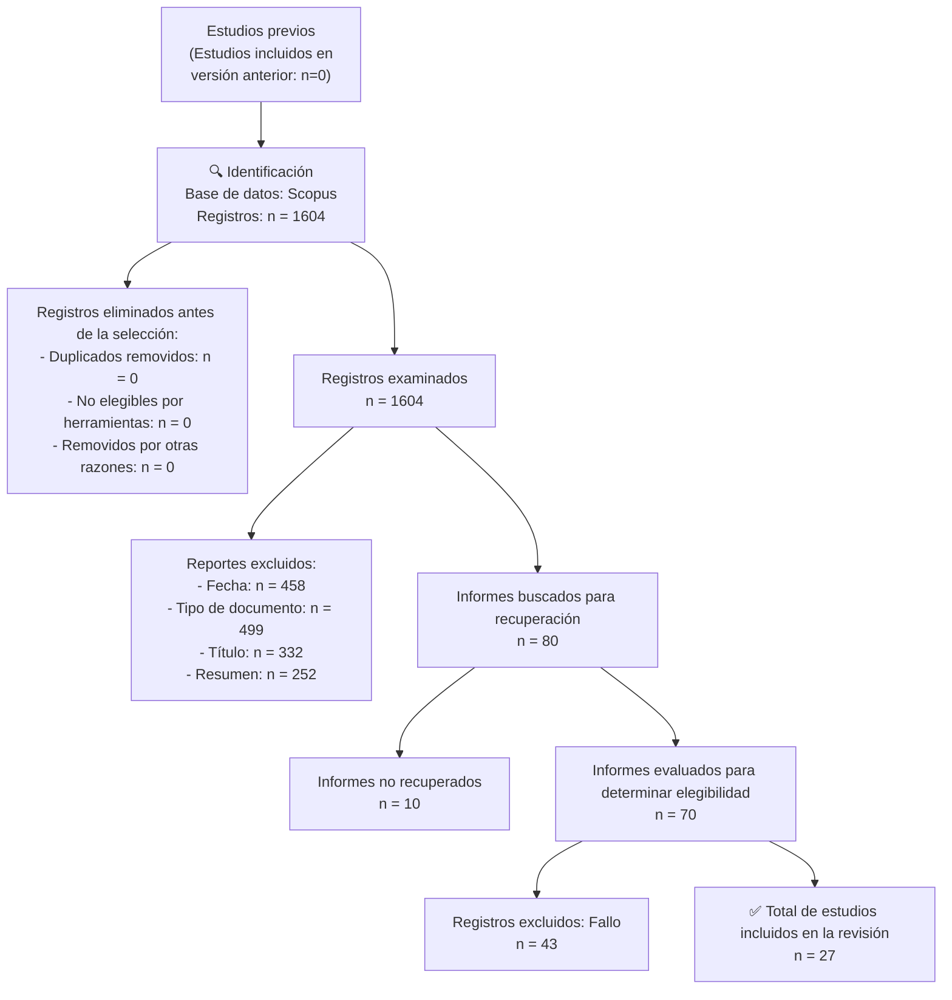

# Systematic Review on the Influence of ERP Implementation in the Business Sector

**Revisión sistemática sobre la influencia de la implementación de los ERP en el sector empresarial**

---

**Autores:**
Alférez Castro, Manuel Hipólito¹; Guzman Aquije, Elvis Henry¹; Gutiérrez Cuadros, Guillermo Andrés¹

¹·³ Universidad Tecnológica del Perú, Perú
`U20302818@utp.edu.pe` | `c20203@utp.edu.pe` | `c18136@utp.edu.pe`

**Publicado en:** 23rd LACCEI International Multi-Conference for Engineering, Education, and Technology — "Engineering, Artificial Intelligence, and Sustainable Technologies in service of society". Hybrid Event, Mexico City, July 16–18, 2025.

**ISBN:** 978-628-96613-1-6 | **ISSN:** 2414-6390
**DOI:** https://dx.doi.org/10.18687/LACCEI2025.1.1.2124

---

## Abstract

The implementation of Enterprise Resource Planning (ERP) systems has transformed business management by integrating data and optimizing processes. This review aims to analyze the impact of ERPs on improving operational efficiency, the technological tools employed, and the limitations identified before and after their implementation. A systematic literature review was conducted using only the Scopus database, selecting **27 articles** published between 2021 and 2024 based on PRISMA criteria. ERPs stand out for enhancing information quality, integrating technologies such as AI and data analytics, and promoting sustainable practices. However, challenges such as organizational resistance to change and infrastructure limitations hinder their effectiveness. It is concluded that ERPs are essential for digital transformation, especially in SMEs, as they drive modernization and sustainability. Future studies should explore emerging technologies and sustainable approaches to maximize their impact on businesses.

**Keywords:** ERP systems, business management, digital transformation, SMEs, sustainability.

---

## Resumen

La implementación de los sistemas de planificación de recursos empresariales (ERP) ha transformado la gestión empresarial al integrar datos y optimizar procesos. Esta revisión tiene como propósito analizar el impacto de los ERP en la mejora de la eficiencia operativa, las herramientas tecnológicas utilizadas y las limitaciones identificadas antes y después de su implementación. Se realizó una revisión sistemática de literatura utilizando únicamente la base de datos Scopus, seleccionando **27 artículos** publicados entre 2021 y 2024 mediante los criterios PRISMA. Los ERP destacan por mejorar la calidad de la información, integrar tecnologías como la IA y análisis de datos, y promover prácticas sostenibles. Sin embargo, desafíos como la resistencia al cambio organizacional y limitaciones en infraestructura restringen su efectividad. Se concluye que los ERP son fundamentales para la transformación digital, especialmente en las PYMEs, al impulsar la modernización y sostenibilidad. Futuros estudios deben explorar tecnologías emergentes y enfoques sostenibles para maximizar su impacto en las empresas.

**Palabras clave:** Sistemas ERP, gestión empresarial, transformación digital, PYMEs, sostenibilidad.

---

## I. Introducción

Los sistemas ERP (_Enterprise Resource Planning_) son herramientas tecnológicas diseñadas para unificar las principales funciones de una organización, incluyendo finanzas, logística y gestión de recursos humanos. Estas herramientas permiten optimizar la gestión de datos, mejorar la eficiencia operativa y tomar decisiones estratégicas más informadas [1][2]. Desde su creación, los ERP han evolucionado para incluir tecnologías avanzadas, como inteligencia artificial (IA) y computación en la nube, que amplían sus capacidades y beneficios [3]. En la actualidad, la digitalización empresarial mediante ERP se considera un factor crítico para la sostenibilidad y competitividad de las organizaciones [4].

Si bien se han realizado numerosos estudios sobre la implementación y los beneficios de los ERP, todavía existen áreas que carecen de una visión integral. Por ejemplo, las discrepancias entre los beneficios esperados y los resultados reales varían adaptándose al tamaño de la empresa y al sector en el que opera. Asimismo, persisten vacíos en la literatura respecto a cómo las nuevas tecnologías, como el uso de aprendizaje automático y análisis predictivo, pueden integrarse efectivamente en los ERP [5][6]. Estos vacíos de conocimiento dificultan la generalización de mejores prácticas y la comprensión de los desafíos que enfrentan las empresas en diferentes contextos.

Este trabajo busca cerrar las brechas de conocimiento identificadas, proporcionando una visión panorámica basada en una revisión sistemática de literatura (RSL). Los resultados de esta revisión no solo serán útiles para investigadores, sino también para empresas que consideren implementar ERP como elemento clave en su estrategia de digitalización empresarial. Al comprender las tendencias actuales y los desafíos asociados, se podrán establecer lineamientos prácticos para optimizar el uso de estos sistemas y fomentar su impacto positivo en el desempeño organizacional.

El propósito central de este estudio es examinar cómo los sistemas ERP influyen en el rendimiento empresarial. Se busca identificar las áreas más afectadas por la implementación de ERP, las tecnologías utilizadas y las limitaciones enfrentadas por las organizaciones, proporcionando un marco integral basado en evidencias.

Esta revisión está estructurada de la siguiente manera:

- **Metodología:** selección y análisis de los 27 artículos revisados con criterios aplicados.
- **Resultados:** áreas de impacto, herramientas tecnológicas empleadas, tecnologías emergentes integradas y principales limitaciones identificadas.
- **Discusión:** implicaciones de los hallazgos en comparación con la literatura existente.
- **Conclusiones:** contribuciones del trabajo y futuras líneas de investigación.

---

## II. Metodología

### A. Estrategia de búsqueda: PICO

El propósito de este trabajo es llevar a cabo una revisión sistemática de la literatura (RSL), un enfoque de investigación especializado que sintetiza información relevante sobre un tema que se desee indagar y profundizar.

Se utilizó el método de búsqueda **PICO** para formular de manera interrogativa los objetivos de las revisiones sistemáticas, ayudando a organizar y enfocar la búsqueda bibliográfica y a facilitar la identificación de términos, criterios de inclusión y exclusión.

Según esta metodología, la RSL está enfocada hacia las empresas del sector empresarial que aún poseen gestiones administrativas semiautomatizadas de manera tradicional y buscan actualizarse para volverse más competitivas, con el fin de mejorar la eficiencia en los procesos y controlar mejor sus recursos.

**Tabla I — Componentes PICO**

| Componente | Categoría    | Descripción                              |
| ---------- | ------------ | ---------------------------------------- |
| **P**      | Población    | Sector empresarial                       |
| **I**      | Intervención | Implementación de los ERP                |
| **C**      | Comparación  | Gestión administrativa semiautomatizada  |
| **O**      | Resultados   | Mejora en el rendimiento de las empresas |

**Tabla II — Preguntas PICO**

| Componente | Categoría    | Pregunta                                                                                      |
| ---------- | ------------ | --------------------------------------------------------------------------------------------- |
| **P**      | Población    | ¿Cuál es el sector donde se enfocará nuestra investigación?                                   |
| **I**      | Intervención | ¿De qué manera se mejorará el rendimiento en las empresas?                                    |
| **C**      | Comparación  | ¿Cuál fue la manera tradicional en que las empresas manejaban sus procesos hace algunos años? |
| **O**      | Resultados   | ¿En dónde se verá el impacto de la implementación de los ERP?                                 |

**Tabla III — Palabras clave PICO**

| Componente | Categoría    | Palabras clave                                                |
| ---------- | ------------ | ------------------------------------------------------------- |
| **P**      | Población    | Enterprises, business, organizations, industry, corporations  |
| **I**      | Intervención | ERP, implementation, adoption, integration, deployment        |
| **C**      | Comparación  | Automation, manual, traditional, digitization, transformation |
| **O**      | Resultados   | Performance, efficiency, productivity, improvement, outcomes  |

**Criterios de inclusión:**

- **CI1:** Los estudios deben abarcar el tema seleccionado
- **CI2:** Los estudios tienen que mostrar los resultados de mejora tras la implementación de los ERP
- **CI3:** Los estudios deben haberse realizado en torno al sector empresarial
- **CI4:** Los estudios deben abordar artículos científicos y revisiones

**Criterio de exclusión:**

- **CE1:** Los estudios no deben estar fuera del rango de 5 años de antigüedad como máximo

### B. Proceso de selección: PRISMA

El proceso de búsqueda y selección de artículos se realizó exclusivamente en la base de datos **SCOPUS**. La fórmula avanzada de búsqueda utilizada fue:

**Tabla IV — Fórmula avanzada Scopus**

```
(TITLE-ABS-KEY (enterprise OR business OR organizations OR industry OR corporation)
AND TITLE-ABS-KEY (erp OR implementation OR adoption OR integration OR deployment
  OR "enterprise resource planning")
AND TITLE-ABS-KEY (automation OR manual OR traditional OR digitization AND transformation)
AND TITLE-ABS-KEY (performance OR efficiency OR productivity OR improvement))
```

**Pasos del proceso PRISMA:**

1. **Búsqueda inicial en SCOPUS:** se obtuvieron **1.604 documentos**.
2. **Búsqueda de duplicados:** sin duplicados al usar una sola base de datos. El valor de 1.604 se mantuvo.
3. **Filtro por fecha** (máximo 5 años de antigüedad): quedaron **1.146 documentos**.
4. **Filtro por tipo de documento** (artículos científicos y revisiones sistemáticas): quedaron **647 documentos**.
5. **Descarga CSV y revisión por título:** se obtuvieron **315 documentos** de interés.
6. **Lectura de resúmenes:** quedaron **80 documentos**.
7. **Recuperación de textos completos por DOI:** se recuperaron **70 documentos completos**; tras lectura completa, quedaron **27 documentos** para la RSL.

**Diagrama de flujo PRISMA:**



_Fig. 1 — Diagrama de flujo PRISMA._

---

## III. Resultados

### Distribución por año de publicación

El análisis cronológico revela un incremento significativo en publicaciones recientes (2021–2024). La mayor cantidad de estudios se realizó en **2022** con 9 artículos, seguido por **2021** con 8 artículos. Los años 2024 y 2023 presentan una menor producción, con 6 y 4 artículos respectivamente [4]–[30].

```
Año de publicación — Número de artículos:

2021  ████████ (8)
2022  █████████ (9)
2023  ████ (4)
2024  ██████ (6)
```

_Fig. 2 — Año de publicación de los artículos._

### Distribución por continente de origen

Asia es el continente con mayor cantidad de artículos (**12**), seguido de Europa con **6** artículos y América del Sur con **4** artículos. África cuenta con **2** estudios, mientras que **3** artículos no especifican una ubicación geográfica particular [4]–[30].

| Continente               | N.º de artículos |
| ------------------------ | :--------------: |
| Asia                     |        12        |
| Europa                   |        6         |
| América del Sur          |        4         |
| Sin ubicación específica |        3         |
| África                   |        2         |
| **Total**                |      **27**      |

_Fig. 3 — Continente de origen del estudio (gráfico de pastel en el original)._

### Tamaño de las empresas estudiadas

Las **PYMEs** son las más representadas con **8 artículos**. Le siguen las empresas grandes (6), las empresas medianas (5), el sector público sin especificación de tamaño (4), y las empresas medianas y grandes (4) [4]–[30].

| Tipo de empresa                        | N.º de menciones |
| -------------------------------------- | :--------------: |
| Pequeñas y Medianas Empresas (PYMEs)   |        8         |
| Empresas Grandes                       |        6         |
| Empresas Medianas                      |        5         |
| Sector Público (sin tamaño específico) |        4         |
| Empresas Medianas y Grandes            |        4         |

_Fig. 4 — Tamaño de las empresas que usan ERP._

### Tipos de ERP implementados

El **ERP genérico** es el más común (9 artículos), seguido por **SAP ERP** con 5 menciones. Las variantes especializadas tienen menor representación [4]–[30].

| Tipo de ERP                                     | N.º de menciones |
| ----------------------------------------------- | :--------------: |
| ERP Genérico                                    |        9         |
| SAP ERP                                         |        5         |
| ERP en la Nube                                  |        3         |
| ERP con Inteligencia Artificial (IA)            |        3         |
| ERP para Industria 4.0                          |        2         |
| ERP con _Life Cycle Assessment_ (LCA)           |        2         |
| ERP con _Robotic Process Automation_ (RPA) e IA |        2         |
| ERP _Open Source_                               |        1         |

_Fig. 5 — Tipos de ERP implementado._

### Áreas de impacto del ERP

La **eficiencia operativa** es el impacto más mencionado (8 artículos), seguida de integración de datos y procesos (7) y productividad (6) [4]–[30].

| Área de impacto                 | N.º de artículos |
| ------------------------------- | :--------------: |
| Eficiencia Operativa            |        8         |
| Integración de Datos y Procesos |        7         |
| Productividad                   |        6         |
| Toma de Decisiones Estratégicas |        5         |
| Sostenibilidad                  |        4         |
| Flexibilidad y Adaptabilidad    |        4         |
| Satisfacción del Usuario        |        3         |

_Fig. 6 — Áreas de impacto del ERP._

### Herramientas tecnológicas específicas utilizadas

**SmartPLS, Análisis PLS y AHP Difuso** son las herramientas más empleadas (6 menciones). Cloud ERP y ERP Digital ocupan el segundo lugar (5 menciones cada una) [4]–[30].

| Herramienta                                                                 | N.º de menciones |
| --------------------------------------------------------------------------- | :--------------: |
| SmartPLS, Análisis PLS, AHP Difuso                                          |        6         |
| Cloud ERP, Integración de ERP en la Nube                                    |        5         |
| ERP Digital, Sistemas de Gestión para Integración de Proveedores y Clientes |        5         |
| ERP con IA, _Robotic Process Automation_ (RPA)                              |        4         |
| Big Data, Internet de las Cosas (IoT), Conectividad para Industria 4.0      |        3         |
| Herramientas de Análisis de Ciclo de Vida (LCA)                             |        3         |
| ERP para Transformación Digital en el Sector Público                        |        2         |

_Fig. 7 — Herramientas específicas usadas por los autores._

### Tecnologías emergentes integradas en los ERP

La **Inteligencia Artificial (IA)** lidera con el **25.93%** de frecuencia. La Computación en la Nube representa el **22.22%**. El resto se distribuye entre RPA, LCA, Big Data e IoT [4]–[30].

| Tecnología emergente               | Frecuencia (%) |
| ---------------------------------- | :------------: |
| Inteligencia Artificial (IA)       |     25.93%     |
| Computación en la Nube             |     22.22%     |
| _Robotic Process Automation_ (RPA) |     18.52%     |
| Análisis del Ciclo de Vida (LCA)   |     18.52%     |
| Big Data                           |     14.81%     |
| Internet de las Cosas (IoT)        |     14.81%     |

_Fig. 8 — Tecnologías emergentes integradas en los ERP (gráfico de pastel en el original)._

> Este análisis porcentual destaca cómo los ERP se están posicionando como herramientas integrales para la transformación digital, adaptándose a las demandas de innovación y sostenibilidad en el entorno empresarial moderno.

### Limitaciones en las empresas antes de implementar ERP

La **deficiencia en la integración de datos** fue el problema más común (8 artículos), seguido por procesos manuales y poco eficientes (7 menciones) [4]–[30].

| Limitación                                                   | N.º de artículos |
| ------------------------------------------------------------ | :--------------: |
| Falta de Integración de Datos                                |        8         |
| Procesos Manuales y Poco Eficientes                          |        7         |
| Dificultad en la Toma de Decisiones                          |        6         |
| Baja Eficiencia Operativa                                    |        5         |
| Falta de Transparencia y Acceso a Información en Tiempo Real |        5         |
| Costos Operativos Elevados                                   |        4         |
| Falta de Flexibilidad y Adaptabilidad                        |        4         |
| Problemas de Escalabilidad                                   |        3         |
| Limitaciones en Sostenibilidad                               |        3         |

_Fig. 9 — Limitaciones en las empresas antes de implementar ERP._

---

## IV. Discusión

Los resultados obtenidos en esta revisión sistemática de la literatura (RSL) destacan tendencias clave en la implementación de sistemas ERP y su influencia en el sector empresarial. Las **PYMEs y grandes empresas** son los principales contextos analizados, lo cual refleja cómo los ERP se adaptan a estructuras organizativas variadas. Esta capacidad de adaptación permite optimizar procesos, eliminar redundancias y mejorar la toma de decisiones estratégicas, áreas identificadas como los mayores impactos de estas plataformas [4], [7].

Un punto crítico identificado es la **falta de atención al usuario final**, evidenciado por una menor cantidad de estudios centrados en la satisfacción del personal al utilizar los ERP. Según Cataldo et al., una experiencia negativa del usuario puede afectar la efectividad general del sistema y generar resistencia al cambio organizacional [19]. Esto representa una oportunidad para futuras investigaciones que evalúen cómo estas herramientas afectan las experiencias laborales y el compromiso de los empleados [20].

Una **fortaleza importante** de este estudio es el uso de la metodología PICO y PRISMA, lo que asegura una selección rigurosa y objetiva de los artículos revisados. Sin embargo, se identifica como **limitación** la concentración de estudios en regiones específicas, como Asia y Europa, lo que puede sesgar los hallazgos y limitar su aplicabilidad en un contexto global [5], [15].

A diferencia de otras revisiones, esta RSL incorpora una comparación sistemática de tecnologías emergentes, como **RPA, inteligencia artificial y análisis del ciclo de vida (LCA)**, en contextos empresariales diversos, con un enfoque particular en organizaciones de menor tamaño y sectores con limitada madurez digital. Este enfoque permite identificar no solo patrones comunes, sino también contradicciones relevantes entre los estudios analizados:

- Mientras Polívka y Dvořáková evidencian la eficacia del uso de tecnologías de Industria 4.0 en la toma de decisiones [29], estudios como el de Santoso et al. advierten sobre la complejidad técnica y la resistencia organizacional que estas tecnologías pueden generar en empresas con menor infraestructura tecnológica [9].
- Aunque algunos estudios destacan beneficios inmediatos derivados del uso de IA y automatización mediante RPA [8], [13], otros como Pérez Estébanez y Roztocki et al. sugieren que su adopción sin una base sólida de capacitación y gestión del cambio puede generar resultados adversos, especialmente en entornos poco tecnificados [6], [15].

Estas observaciones permiten proyectar nuevas rutas para futuras investigaciones:

- Analizar cómo se comportan los ERP integrados con tecnologías emergentes en **microempresas o sectores informales**, donde la evidencia aún es escasa.
- Estudiar el **impacto a largo plazo** de estas implementaciones en contextos con baja madurez digital.
- Evaluar el vínculo entre **sostenibilidad y digitalización** mediante indicadores como el análisis del ciclo de vida [16], [22].

Finalmente, dada la **limitada presencia de estudios latinoamericanos** en la muestra, resulta fundamental reflexionar sobre la aplicabilidad de los hallazgos en esta región. En países como Perú, donde muchas empresas aún gestionan sus procesos de forma manual o semiautomatizada, la adopción de sistemas ERP enfrenta desafíos como la informalidad, la limitada inversión tecnológica y la baja cultura digital. Adaptar las buenas prácticas a estos contextos requiere un enfoque progresivo, sostenido por políticas públicas, capacitación técnica y soluciones tecnológicas escalables que faciliten una transición gradual y sostenible hacia la transformación digital.

---

## V. Conclusiones

La presente revisión sistemática proporciona una visión integral sobre el impacto de los sistemas ERP en el sector empresarial, subrayando su capacidad para mejorar la **eficiencia operativa**, integrar datos y transformar procesos estratégicos. Las **PYMEs** se destacan como el principal foco de las implementaciones ERP, dado su potencial para modernizar estructuras organizativas menos desarrolladas.

La principal contribución de esta investigación radica en la identificación de:

- **Áreas de impacto clave:** eficiencia operativa, integración de datos y procesos, productividad y toma de decisiones.
- **Herramientas tecnológicas innovadoras:** inteligencia artificial y soluciones en la nube, que están revolucionando la gestión empresarial.
- **Criterios de sostenibilidad** en los ERP, un aspecto que aún necesita mayor atención.

Desde un **enfoque práctico**, este trabajo sirve como guía para las empresas interesadas en adoptar ERP, destacando la necesidad de:

1. Alinear los ERP con objetivos estratégicos.
2. Capacitar al personal.
3. Fomentar la innovación tecnológica.

En términos de **limitaciones**, la concentración geográfica de los estudios analizados restringe la generalización de los resultados. No obstante, esta revisión plantea oportunidades relevantes para futuras investigaciones, especialmente orientadas al **contexto latinoamericano**.

En resumen, la implementación de ERP sigue siendo un eje transformador en el sector empresarial, cuyo éxito dependerá de enfoques que integren la **tecnología, la sostenibilidad y el enfoque centrado en el usuario**. Esta RSL destaca por su enfoque comparativo, su metodología rigurosa y su propuesta de nuevas rutas de estudio que pueden guiar decisiones estratégicas tanto en el ámbito académico como en el empresarial.

---

## Referencias

[1] C. Oliveira, M. Pereira, M. M. Mendes Rodrigues, and R. Rodrigues, "Entrepreneur's strategy leveraged and monitored by the interrelation of ERP and BSC," _Journal of information and organizational sciences_, vol. 48, no. 1, Faculty of Organisation and Informatics, pp. 19–48, Jun. 25, 2024. doi: 10.31341/jios.48.1.2.

[2] A. Puig-Denia, B. Forés, J. M. Fernández-Yáñez, and M. Boronat-Navarro, "INTRODUCING AN OPEN-SOURCE SOFTWARE FOR THE ENTERPRISE RESOURCE PLANNING IN THE BUSINESS MANAGEMENT DEGREE," _INTED Proceedings_, vol. 1, IATED, pp. 7250–7258, Mar. 2023. doi: 10.21125/inted.2023.1991.

[3] A. M. Andriev and I. Ungureanu, "ERP and performance of companies in Romania," _J. Risk Financ. Manage._, vol. 15, no. 10, p. 433, Sep. 2022. doi: 10.3390/jrfm15100433.

[4] Z. J. Tarigan et al., "Key User ERP Capability Maintaining ERP Suitability Through Effective Design of Business Processes and Integration Data Management," _Int. J. Data Sci._, vol. 48, no. 1, pp. 19–48, 2021.

[5] R. F. Frogeri et al., "Adoption of ERP Systems in Small and Medium Enterprises: A Study of Multiple Cases in Southern of Minas Gerais," _J. Inf. Syst. Eng. Manage._, vol. 7, no. 2, 2022. doi: 10.55267/iadt.07.12244.

[6] R. Pérez Estébanez, "An Approach to Sustainable Enterprise Resource Planning System Implementation in Small- and Medium-Sized Enterprises," _Admin. Sci._, vol. 14, no. 5, 2024. doi: 10.3390/admsci14050091.

[7] Y. Zaitar, "Analyzing the Contribution of ERP Systems to Improving the Performance of Organizations," _Ingénierie des Systèmes d'Information_, vol. 27, no. 4, 2022. doi: 10.18280/isi.270404.

[8] C. Aktürk, "Artificial Intelligence in Enterprise Resource Planning Systems: A Bibliometric Study," _J. Int. Log. Trade_, vol. 19, no. 2, 2021. doi: 10.24006/jilt.2021.19.2.069.

[9] R. W. Santoso et al., "Assessing the Benefit of Adopting ERP Technology and Practicing Green Supply Chain Management toward Operational Performance," _Sustainability_, vol. 14, no. 94944, 2022. doi: 10.3390/su14094944.

[10] C. Jesus and R. M. Lima, "Business Processes Reconfiguration Through the Implementation of an ERP System," _J. Appl. Eng. Sci._, vol. 39, no. 2, pp. 88–102, 2021. doi: 10.5937/jaes0-27393.

[11] N. M. Alsharari, "Cloud Computing and ERP Assimilation in the Public Sector: Institutional Perspectives," _Transforming Gov.: People, Process Policy_, vol. 16, no. 4, pp. 345–361, 2022. doi: 10.1108/TG-04-2021-0069.

[12] Y. Zhang and F. Huang, "Implications for Sustainability Accounting and Reporting in the Context of the Automation-Driven Evolution of ERP Systems," _Electronics_, vol. 12, no. 1819, 2023. doi: 10.3390/electronics12081819.

[13] D. A. Almajali et al., "Enhancing Corporate Performance Through Transformational Leadership in AI-driven ERP Systems," _J. Inf. Syst. Eng. Manage._, 2024. doi: 10.55267/iadt.07.14797.

[14] D. Abdelkarim et al., "Enterprise Resource Planning Success in Jordan from the Perspective of IT-Business Strategic Alignment," _Cogent Soc. Sci._, 2022. doi: 10.1080/23311886.2022.2062095.

[15] N. Roztocki et al., "Enterprise Systems in the Public Sector: Driving Forces and a Conceptual Framework," _Inf. Syst. Manage._, 2023. doi: 10.1080/10580530.2022.2140229.

[16] Z. El Haouat et al., "Environmental Optimization and Operational Efficiency: Analysing the Integration of Life Cycle Assessment (LCA) into ERP Systems in Moroccan Companies," _Results Eng._, 2024. doi: 10.1016/j.rineng.2024.102131.

[17] A. Balić et al., "ERP Quality and the Organizational Performance: Technical Characteristics vs. Information and Service," _Inf._, vol. 13, no. 474, 2022. doi: 10.3390/info13100474.

[18] B. Dağcı and F. Ersöz, "Evaluation of ERP Software Selection Criteria with Fuzzy AHP Approach: An Application in the Metal Production Enterprises in the Aviation Industry," _Int. J. Syst. Assur. Eng. Manage._, vol. 11, no. 3, 2024. doi: 10.1007/s13198-024-02287-x.

[19] A. Cataldo et al., "Factors Influencing the Post-Implementation User Satisfaction of SAP-ERP," _Ingeniare. Rev. Chil. Ing._, vol. 30, no. 3, 2022.

[20] R. Shkurti and E. Manoku, "Factors of Success in Implementation of Enterprise Resource Planning," _WSEAS Trans. Bus. Econ._, vol. 18, no. 102, 2021. doi: 10.37394/23207.2021.18.102.

[21] M. H. Miraz et al., "What Factors Affect the Adoption of Cloud-Based ERP in Companies' Operations in Malaysia?," _Int. J. Manage. Sustain._, vol. 13, no. 3, 2024. doi: 10.18488/11.v13i3.3827.

[22] A. Kouriati et al., "Evaluation of Critical Success Factors for ERP Implementation in Agricultural Processing Companies," _Sustainability_, vol. 14, no. 6606, 2022. doi: 10.3390/su14116606.

[23] R. H. Kusumawardhana et al., "Identifying Critical Success Factors in ERP Implementation Using AHP: A Case Study of a Social Insurance Company in Indonesia," _J. Cases Inf. Technol._, vol. 26, no. 3, 2023. doi: 10.4018/JCIT.337389.

[24] K. Sulaimon et al., "Open-Source Enterprise Resource Planning Systems for Small and Medium Enterprises: A Conceptual Framework," _J. Int. Bus. Econ. Entrepr._, vol. 9, no. 2, 2024. doi: 10.24191/jibe.v9i2.3575.

[25] A. Domagała et al., "Post-Implementation ERP Software Development: Upgrade or Reimplementation," _Appl. Sci._, vol. 11, no. 11, 2021. doi: 10.3390/app11114937.

[26] S. Salih et al., "Prioritising Organisational Factors Impacting Cloud ERP Adoption and the Critical Issues Related to Security, Usability, and Vendors: A Systematic Literature Review," _Sensors_, vol. 21, no. 24, 2021. doi: 10.3390/s21248391.

[27] A. Svensson et al., "Risk Factors When Implementing ERP Systems in Small Companies," _Inf._, vol. 12, no. 11, 2021. doi: 10.3390/info12110478.

[28] K. J. Harianto et al., "The Effect of Digital ERP Implementation, Supply Chain Integration, and Supply Chain Flexibility on Business Performance," _Int. J. Data Netw. Sci._, vol. 8, no. 4, 2024. doi: 10.5267/j.ijdns.2024.5.017.

[29] M. Polívka and L. Dvořáková, "The Importance of Industry 4.0 Technologies When Selecting an ERP System: An Empirical Study," _E&M Econ. Manage._, vol. 23, no. 3, 2023. doi: 10.15240/tul/001/2023-3-004.

[30] G. T. Pontoh et al., "Transforming Public Sector Operations with Enterprise Resource Planning: Opportunities, Challenges, and Best Practices," _Corp. Law Gov. Rev._, vol. 6, no. 2, 2024. doi: 10.22495/clgrv6i2p1.
