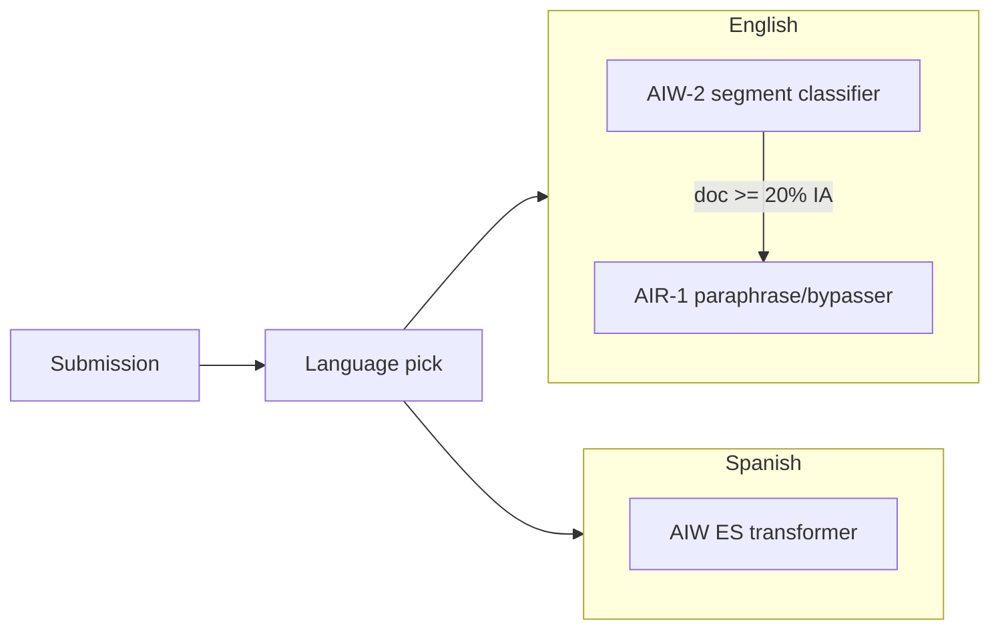

# Detección de escritura con IA — simulación Turnitin RSL

Fuente de verdad para el agente **`turnitin-rsl`**, las skills **`rsl-turnitin-informe`** y **`rsl-turnitin-arreglar`**, y el script **`pnpm turnitin:qualified`**.

**Alcance:** simulación pedagógica alineada con la documentación pública de Turnitin (whitepaper *AI Writing Detection Model Architecture and Testing Protocol*, agosto 2024; FAQ inglés sep-2026; FAQ español may-2026). **No** reproduce AIW-2 ni AIR-1 comerciales. El porcentaje simulado **no** determina mala conducta ni sustituye la política institucional.

**Independiente** del informe de similitud (plagio). Objetivo: pre-vuelo antes de entrega con Turnitin institucional.

## Herramientas

| Uso | Comando / rol |
|-----|----------------|
| Texto calificado + oraciones S1…Sn | `pnpm -s turnitin:qualified <archivo.md>` → JSON |
| Informe estructurado | agente `turnitin-rsl` (skill `rsl-turnitin-informe`) |
| Revisión legítima del manuscrito | skill `rsl-turnitin-arreglar` |
| Forma académica tras arreglar | `pnpm -s redaccion:lint` + agente `redaccion-rsl` |

## Arquitectura de referencia (Turnitin documentado)



- **AIW-2:** clasificador transformer; ventanas ~5–10 oraciones; **stride 1 oración**; puntaje segmento 0–1.
- **Oración:** **promedio ponderado** de puntajes de ventanas que la contienen (pesos reales no publicados).
- **Umbral oración:** tunado; valor numérico **no publicado** → simulación usa **`T_sim = 0,50`** (etiquetado explícito como simulación).
- **Documento:** indicador numérico estable si **>20 %** del contenido calificado supera umbral a nivel oración; **1–19 % → `*%`** (más falsos positivos).
- **AIR-1:** solo **inglés**; solo si documento ≥20 % IA; solo oraciones ya marcadas IA; resaltado **púrpura** (IA + parafraseo/bypasser). **Español: sin AIR-1.**

Turnitin prioriza **bajo FPR** (<1 % en docs con >20 % IA; stress-test 719 877 papers pre-2019 → FPR documento ~0,51 % AIW-2). Un **50 %** mostrado puede corresponder hasta ~**65 %** IA real (FAQ).

## Pipeline operativo (pasos 0–8)

| Paso | Acción |
|------|--------|
| 0 | Licencia/feature: asumir entorno académico; idioma `es` o `en` según JSON `languageHint` |
| 1 | Validación: `.md`, ≥300 y ≤30 000 palabras calificadas (`turnitin:qualified`) |
| 2 | Extracción texto calificado (prosa párrafos; excluir listas, tablas, código, refs, YAML) |
| 3 | Segmentación: ventanas **W=8 oraciones** (dentro de 5–10), **stride 1** |
| 4 | Puntaje segmento 0–1 (rúbrica §5) |
| 5 | Herencia oración: media ponderada (§6) |
| 6 | Umbral `T_sim`; agregación % oraciones y % palabras sobre calificado |
| 7 | Indicador `0` \| `*%` \| `NN%` \| `--` \| `!` |
| 8 | Revisión humana sugerida (§Anexo B) |

Textos con **un solo segmento** (pocas oraciones): predicción «todo o nada»; **confianza baja**.

## Texto calificado

Incluir: oraciones en párrafos de prosa (ensayo, informe, paper).

Excluir (no cuentan para % ni segmentos):

- Frontmatter YAML
- Encabezados `#` solos
- Tablas `|`
- Bloques ` ``` `
- Listas `-` / `*` / numeradas como ítem aislado
- Sección Referencias / References en adelante
- Poesía, guiones, ecuaciones aisladas

El script `turnitin:qualified` implementa esta extracción (alineado con `redaccion:lint`).

## Rúbrica de simulación (puntaje segmento 0–1)

Evaluar cada ventana con sub-scores 0–1 y combinar con **media aritmética** (simulación; Turnitin usa transformer entrenado).

| Sub-score | Señales que suben (IA aparente) | Señales que bajan (humano aparente) |
|-----------|----------------------------------|-------------------------------------|
| Probabilidad secuencial | Frases intercambiables, conectores vacíos («es importante destacar», «en este sentido», «de esta manera»), simetría entre párrafos | Datos propios, cifras, fechas, nombres de curso/caso |
| Variación estructural | Oraciones de longitud uniforme, mismo molde sintáctico | Mezcla natural de frases cortas y largas |
| Especificidad académica | Definiciones de manual sin fuente ni página | Citas (Autor, año), páginas, limitaciones del propio trabajo |
| Posición | Intro/conclusión genérica (FP-risk FAQ 2026) | Apertura con dato o pregunta concreta del trabajo |
| Repetición | Misma estructura literal entre párrafos | Reformulación con idea nueva |

**Penalizaciones FAQ (falsos positivos):** poca variación estructural; repetición literal; parafraseo sin ideas nuevas.

**Puntaje segmento** = promedio de los cinco sub-scores.

## Herencia oración y agregación (simulación)

Para cada oración `Si`, sea `Wk` el conjunto de ventanas que la contienen. Peso documentado (simulación):

```text
w_k = 1 + (1 - |pos(Si en Wk) - centro(Wk)| / (|Wk|/2))
```

(`pos` = índice 0-based de la oración dentro de la ventana; `centro` = (|Wk|-1)/2.)

**Puntaje(Si)** = Σ (w_k × score(Wk)) / Σ w_k.

**Marcada IA (simulación):** Puntaje(Si) ≥ **T_sim (0,50)**.

**% oraciones IA** = oraciones marcadas / total calificadas.

**% palabras IA** = palabras en oraciones marcadas / palabras calificadas.

**Indicador simulado:**

| Condición | Indicador |
|-----------|-----------|
| No processable | `--` |
| 0 % | `0` |
| 1–19 % (cualquier base) | `*%` |
| ≥20 % | `NN%` (entero redondeado, base % palabras calificadas; reportar también % oraciones) |
| Fallo técnico | `!` |

En banda `*%`: informe completo pero **sin** tramos `reescritura` obligatorios por FP-risk; preferir `accion_tipo: proceso` o `ninguna`.

## AIR-1 simulado (solo `idioma: en` y doc ≥20 % palabras IA)

Sobre oraciones ya ≥ T_sim: sub-rúbrica «probable bypass/paraphrase» (uniformidad post-edición, sinónimos sistemáticos, ritmo artificial). Si ≥ 0,55 → categoría **purpura**; si no → **cian**.

Español: solo **cian**; nota «sin detección bypasser oficial».

## Contrato del informe (`*-informe-turnitin.md`)

Salida obligatoria de `turnitin-rsl`. La skill **`rsl-turnitin-arreglar`** lee **frontmatter + `## Tramos accionables` + `## Orden de aplicación`**.

### Frontmatter YAML

```yaml
---
turnitin_rsl_informe: "1"
source_file: paper-polish.md
source_path: docs/.../paper-polish.md
idioma: es
indicador_simulado: "42%"   # o "*%", "0", "--", "!"
qualified_words: 4200
sentence_count: 318
pct_oraciones_ia: 38
pct_palabras_ia: 42
confianza_informe: alta | media | baja
veredicto: INFORME_COMPLETO | NO_PROCESABLE
tramos_accionables: 3
modelo_referencia: AIW-2-sim [+ AIR-1-sim si en]
---
```

### Cuerpo (orden fijo)

1. **`## Resumen ejecutivo`** — ≤8 viñetas.
2. **`## Tramos accionables`** — tabla:

| tramo_id | oraciones | puntaje | categoria | excerpt | causa | reglas | accion_tipo | pasos |
|----------|-----------|---------|-----------|---------|-------|--------|-------------|-------|

- `accion_tipo`: `reescritura` | `proceso` | `ninguna`
- `categoria`: `cian` | `purpura` | `fp_riesgo`
- `pasos`: numerados en celda (1. … 2. …)

3. **`## Orden de aplicación`** — lista `TR001`, `TR002`, …
4. **`## Diagnóstico completo`** — tablas Segmentos, Oraciones, Desajuste % vs resaltado.
5. **`## Revisión humana sugerida`**
6. **`## Lectura crítica`** — citar limitaciones (Temple, Langara, Weber-Wulff) si indicador ≥20 % o texto mixto.

### Convención de archivos (misma carpeta que el origen)

| Origen | Informe | Salida arreglar |
|--------|---------|-----------------|
| `paper-polish.md` | `paper-polish-informe-turnitin.md` | `paper-polish-turnitin.md` |
| `informe-polish.md` | `informe-polish-informe-turnitin.md` | `informe-polish-turnitin.md` |

Stem = nombre del polish sin `.md`. **No** sobrescribir el polish.

## Remediación R1–R13

| Regla | Tipo | Pasos típicos en informe |
|-------|------|---------------------------|
| R1 | proceso | Documentar historial de versiones; evitar pegados masivos |
| R2 | proceso | Conservar borradores, notas, fuentes fechadas |
| R3 | proceso | Esquema previo de tesis y evidencia |
| R4 | reescritura | Anclar párrafo en dato/caso/cita con página |
| R5 | reescritura | Añadir análisis, comparación u objeción |
| R6 | reescritura | Variar estructuras; eliminar repeticiones literales |
| R7 | reescritura | Verificar fuentes (existencia, página) |
| R8 | reescritura | Prosa concreta; vocabulario propio |
| R9 | reescritura | Recortar conectores vacíos sin aportar |
| R10 | reescritura | No forzar sofisticación léxica |
| R11 | proceso | Distinguir corrector vs generativo (Grammarly etc.) |
| R12 | **prohibido** | No humanizadores ni parafraseadores anti-detector |
| R13 | **prohibido** | No afinar contra detectores gratuitos |

Mapeo causa → reglas: genérico → R4,R5,R9; repetición → R6; FP-risk → R1–R3 + nota en chat.

## Prohibiciones (agente y skills)

- Humanizers, bypassers, evasión de detectores.
- Afirmar paridad con Turnitin comercial o publicar umbrales como «oficiales» (salvo `T_sim` etiquetado).
- Editar `paper-polish.md` / `informe-polish.md` desde estas skills (salvo petición explícita del usuario).

## Evidencia externa (resumen)

| Fuente | Lectura |
|--------|---------|
| Turnitin whitepaper 2024 | Arquitectura, FPR, stride, AIR-1 |
| FAQ 2026 | Modelos LLM cubiertos, `*%`, asimetría 50/65 % |
| Weber-Wulff et al. 2023 | Detectores imprecisos en batería académica |
| Temple / EdTech 2025 | Resaltado por oración poco fiable en textos mixtos |
| Langara EdTech 2026 | Bypassers no detectados fiablemente |
| Liang / Stanford 2023 | Riesgo sesgo L2 en detectores (tipo de riesgo) |

## Anexo A — Ejemplo didáctico (6 oraciones, paso 3)

Ilustración pedagógica (no stride oficial): ventanas S1–S6, S4–S9, S7–S12 con paso 3; umbral 0,50; muestra contagio entre vecinas. La **implementación RSL** usa stride **1** y ventana **8** oraciones.

## Anexo B — Preguntas revisión humana (FAQ Turnitin)

Si indicador ≥20 % o tramos marcados, sugerir al autor:

1. ¿Cómo elegiste fuentes y estructura del argumento?
2. ¿Qué partes escribiste primero y qué revisaste después?
3. ¿Puedes explicar con tus palabras el tramo resaltado sin leerlo?
4. ¿Usaste IA o herramientas generativas? ¿Dónde y con qué permiso del curso?
5. ¿Qué cambiarías si tuvieras una semana más?

## Bibliografía

1. Turnitin, *AI Writing Detection Model Architecture and Testing Protocol* (ago 2024): https://www.buffalo.edu/content/www/lms/guides-instructors/integrations/turnitin/_jcr_content/root/maincontent/par/download/file.res/Turnitin%E2%80%99s%20AI%20Writing%20Detection%20Model%20Architecture%20and%20Testing%20Protocol.pdf
2. FAQ EN (21-sep-2026): https://guides.turnitin.com/hc/en-us/articles/28477544839821
3. FAQ ES (5-may-2026): https://guides.turnitin.com/hc/es/articles/28477544839821
4. AI writing detection model: https://guides.turnitin.com/hc/en-us/articles/28294949544717-AI-writing-detection-model
5. Weber-Wulff et al.: https://arxiv.org/abs/2306.15666
